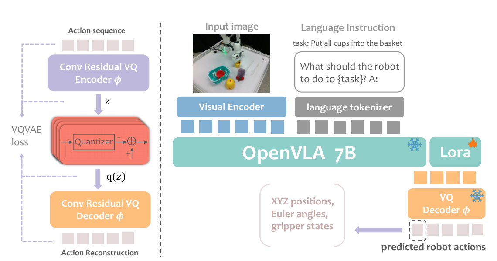
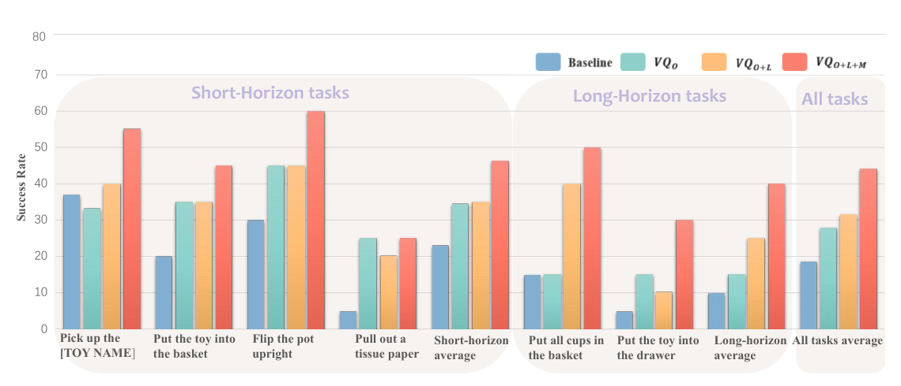

# 060. VQ-VLA：详细阅读指南

**VQ-VLA: Improving Vision-Language-Action Models via Scaling Vector-Quantized Action Tokenizers**  
Yating Wang, Haoyi Zhu, Mingyu Liu, Jiange Yang, Hao-Shu Fang, Tong He · **ICCV 2025**  
固定版本：**arXiv:2507.01016v1，2025-07-01，10 页** · 阅读状态：`unread`  
整理日期：2026-10-06。下文的 p./pp. 均指本地 PDF 的物理页码，第一页为 p. 1。

- [本地固定版本 PDF](paper-arxiv-v1.pdf)
- [官方 arXiv / 版本记录](https://arxiv.org/abs/2507.01016v1) · [论文 HTML](https://arxiv.org/html/2507.01016v1)
- [作者项目页](https://xiaoxiao0406.github.io/vqvla.github.io/) · [官方代码](https://github.com/xiaoxiao0406/VQ-VLA)
- [返回 VLA paper library](../README.md)

这份 README 按“直觉 → 小例子 → 数学 → 训练与推理 → 实验 → 边界”展开，尽量让你不依赖其他笔记也能读懂。**论文结果**注明原文位置；**教学例子、补充推导与阅读判断**会单独说明。这里整理阅读材料，没有训练或运行模型，下面的成功率、GPU 预算和频率均为作者报告。

## 1. 先抓住论文在做什么

机器人动作通常是一串连续数值，例如手臂下一步往哪里移动、如何旋转、夹爪是否闭合。OpenVLA 把这些数值分别离散化成 tokens，再像生成文字一样生成动作。

VQ-VLA 换了一种动作“语言”：**先把一小段连续动作编码成少量离散 tokens，再让 OpenVLA 学会预测这些 tokens，最后用 decoder 把 tokens 还原成一段连续动作。** 为了让这套动作语言能覆盖更多任务，作者用大量真实与模拟轨迹预训练 action tokenizer。

你可以把它想成两件事：先编一部适合机器人动作的词典，再教一个能看图、读指令的模型使用这部词典。词典只看动作数据；使用词典的 VLA 才需要图像和语言。

| 阅读时遇到的词 | 在本文里具体指什么 |
|---|---|
| action chunk | 连续若干时间步的动作，本文 downstream 设置使用长度 5 |
| action tokenizer | 把连续动作 chunk 转成离散 token IDs 的 encoder 与 quantizer |
| codebook | 一组可学习的 latent vectors；每个 vector 对应一个整数索引 |
| VQ / Vector Quantization | 用 codebook 里的向量代表一个连续向量 |
| Residual VQ / RVQ | 第一层量化后，下一层继续量化还没有解释的残差 |
| detokenization | 查 codebook，并用 decoder 从 tokens 重建连续动作 |
| scaling | 扩大 tokenizer 的训练轨迹数据，观察 downstream policy 是否受益 |

**不要与 [VQVLA](../101-vqvla/README.md) 混淆。** VQ-VLA 的量化对象是动作的 latent representation；VQVLA 是另一个条目，研究 weight Vector Quantization 与专用加速器。本文也不同于 W4A4/W4A8 这类 backbone weight/activation quantization：它减少动作生成的表示长度，并没有把 OpenVLA 权重转换成低比特部署格式。

## 2. 为什么动作值得单独设计 tokenizer？

### 2.1 从 OpenVLA 的 binning 开始

原文 Sec. 3.1（p. 2）介绍：OpenVLA 每个动作维度使用 256 个 bins，范围参考训练分布的第 1 和第 99 percentiles，减少极端值对离散化范围的影响。以 7 维动作示意，一个时间步可以写成：

$$
a_t=(x_t,y_t,z_t,\theta^x_t,\theta^y_t,\theta^z_t,g_t).
$$

前六项描述位置与朝向，最后一项描述 gripper。具体任务可能使用位置增量、绝对位置或不同的旋转表示，不能把这一示意当成所有数据集统一的物理定义。

每个数分别找所在的 bin，就得到 7 个整数。若直接逐维逐步表示 5 步动作，则是 $5\times7=35$ 个 action tokens，另有 prompt、图像与结束标记等开销。

这个方法容易实现，但 tokenization 本身没有利用两个事实：

1. **时间相关性**：下一步动作通常与上一步相近，一段运动有整体形状。
2. **维度相关性**：移动、旋转与开合夹爪经常配合发生，不能只把它们理解成互不相关的数字。

这里说的是 binning 没有主动压缩这些结构；并不意味着 OpenVLA 的 Transformer 完全学不到动作相关性。

### 2.2 一个容易理解的动作例子

**教学示意，数值不是论文实验。** 假设五步横向位移为：

$$
[0.10,\;0.12,\;0.14,\;0.16,\;0.18].
$$

逐步表示需要保存五个数。若模型已经学会“逐渐增大向右的位移”的模式，它可以用一个紧凑 latent 表示这段运动，再用少量 codebook indices 近似表示 latent。

这不是手工指定某个 token 就叫“向右移动”。真实 token 是学习到的 latent code，可能同时编码多维、多步动作的信息；它未必具有一个能用自然语言准确命名的含义。

需要同时考虑两种质量：**编码后能否还原原动作**，以及**VLA 能否从当前图像和语言预测正确编码**。动作词典很精细，但 tokens 特别难预测，最终任务仍可能失败。

## 3. 看懂 Fig. 1：谁学什么，谁在推理时工作？



上图摘自本地 PDF p. 3 的 Fig. 1，原图符号用 $z$ 表示 encoder latent；正文使用 $x$，下文沿用正文。

### 3.1 左边：先训练动作词典

输入只有连续动作序列。encoder 把动作变成 latent；RVQ 把 latent 变成 codebook indices；decoder 尝试重建原动作。训练希望重建动作与输入接近，同时让 encoder 的输出和 codebook 配合好。

这一阶段不靠图片理解“杯子在哪里”，也不靠语言理解“拿杯子”。它学习的是动作数据本身的结构，例如连续性、动作维度之间的组合，以及轨迹中常出现的变化模式（Secs. 3.2–3.3，pp. 3–4）。

### 3.2 右边：让 OpenVLA 学会使用动作词典

tokenizer 训练完成后冻结。对于 downstream demonstrations，先把示范动作编码成 ground-truth tokens；随后输入 observation image 和 language instruction，让 OpenVLA 通过 LoRA 微调预测这些 tokens。

冻结 tokenizer 的理由可以这样理解：如果微调 VLA 时动作词典不断改变，同一条示范轨迹的标签也会改变。固定词典，VLA 才能学习一个稳定的预测目标。这个解释是对训练设计的直觉说明，并非论文给出的稳定性定理。

### 3.3 真正部署时

执行路径是：**图像与指令 → OpenVLA 预测 action tokens → codebook lookup / RVQ 重组 → frozen decoder → 连续 action chunk → robot execution。**

此时没有未来的 ground-truth actions，因此不需要先用 action encoder 编码未来动作。encoder 主要用于 tokenizer 训练与构造 VLA 训练标签；decoder 用于把预测 tokens 变回可执行数值。

这里的“一次预测五步”是局部 action chunking。它本身不等于显式 world model，也没有给出 CEM/MPC 这类独立的搜索 planner。

## 4. VQ 与 Residual VQ：从查词典到逐层补误差

### 4.1 普通 VQ 的基本动作

设 encoder 输出一个 $k$ 维向量 $x$，codebook 为：

$$
E=\{e_0,e_1,\ldots,e_{M-1}\},\qquad e_j\in\mathbb R^k.
$$

最基本的 nearest-neighbor VQ 可写成：

$$
z=\arg\min_{j\in\{0,\ldots,M-1\}}\|x-e_j\|_2^2,
\qquad q(x)=e_z.
$$

这是为理解 RVQ 补充的标准 VQ 表达。**整数 $z$ 是 token；向量 $e_z$ 是这个 token 查表后得到的 code。** 整数的大小不表示动作大小，两个相邻 ID 也不保证对应两个相近动作。

普通 VQ 的局限是：只选一个 code，剩余误差都保留下来。若想同时有很多种模式和很高精度，单层 codebook 可能需要变得很大。

### 4.2 Residual VQ 的核心：下一层解释上一层剩下的部分

本文 Sec. 3.2（p. 3）写成：

$$
r_1=x,\qquad r_{i+1}=r_i-q_i(r_i),
\qquad q(x)=\sum_{i=1}^{N_q}q_i(r_i).
$$

逐句读：第一层面对完整 latent $x$；选完第一个 code 后，把已解释的部分减掉；第二层只处理剩余误差；重复 $N_q$ 层；最后把各层选中的 codes 相加，得到对 $x$ 的近似。

其中 $N_q$ 是 quantization stages 的数量，$q_i$ 使用第 $i$ 层的 codebook，$r_i$ 是进入这一层的 residual。注意 $i$ 是**量化层编号**，不是机器人时间步编号。

### 4.3 一个两层 RVQ 的数值例子

**教学例子，不是论文的 latent 维度或实际 codebook。** 假设 encoder 输出：

$$
x=(0.9,\;0.4).
$$

第一层选到 code $(1.0,0.0)$，则剩余：

$$
r_2=(0.9,0.4)-(1.0,0.0)=(-0.1,0.4).
$$

第二层选到 code $(0.0,0.5)$，最终重组：

$$
q(x)=(1.0,0.0)+(0.0,0.5)=(1.0,0.5).
$$

只用第一层时，平方误差为 $0.1^2+0.4^2=0.17$；加上第二层后为 $0.1^2+0.1^2=0.02$。这个例子说明“残差补偿”如何工作；并不保证任意训练好的 RVQ 每一层都改善最终机器人控制。

发送或预测的是两层各自的 indices。decoder 得到的则是查表后相加的向量 $(1.0,0.5)$，再从它恢复多步动作。

### 4.4 多层词典意味着什么？

若每层都有 256 个 codes，$N_q$ 层理论上能构成 $256^{N_q}$ 种 index combinations，而只需选择 $N_q$ 个 indices。这解释了 RVQ 如何在小词典基础上获得较丰富的组合。

但组合数量不是可靠控制能力的证明：有些组合可能从未出现在训练数据中，某些错误组合可能解码为不合适的轨迹。也不能仅根据“前层较粗、后层补细节”就断言本文支持随时截断 tokens 并输出有效动作；本文没有验证类似 OAT 的 prefix-based detokenization。

## 5. 数学与网络：每个变量分别做什么？

### 5.1 Encoder、quantizer、decoder 的完整关系

原文记作 $a_{t:t+n}\in\mathbb R^{n\times d}$。为避免区间端点的歧义，这里把恰好 $n$ 个时间步写成：

$$
A_t=[a_t,a_{t+1},\ldots,a_{t+n-1}]\in\mathbb R^{n\times d}.
$$

完整压缩与重建过程为：

$$
x=\phi_{\mathrm{enc}}(A_t),\qquad
\bar x=q(x),\qquad
\widehat A_t=\phi_{\mathrm{dec}}(\bar x).
$$

| 符号 | 含义 | 容易混淆的地方 |
|---|---|---|
| $n$ | 输入动作的时间步数 | downstream chunk length 为 5，不能把它当成 RVQ 层数 |
| $d$ | 单步动作维度 | 与 latent dimension 不同，取决于动作定义 |
| $k$ | 正文抽象表示中的 latent dimension | 不是 vocabulary size |
| $x$ | encoder 产生的连续 latent | 不是机器人真实状态，也不是 token ID |
| $N_q$ | RVQ quantization stages 数量 | 层数与 codebook size 是两种预算 |
| $z_i$ | 第 $i$ 层选中 code 的整数索引 | $z_i$ 本身不能直接送给机器人执行 |
| $\bar x$ | 各层 codes 相加后的 quantized latent | decoder 的输入 |
| $\widehat A_t$ | decoder 重建的动作 chunk | 仍需按任务的动作接口执行 |

原文用抽象向量说明公式；实际网络里的 latent 可有更丰富的 tensor structure。只看这组公式，无法确定所有卷积层的尺寸、padding 和 latent 排列。

### 5.2 为什么使用 temporal convolution？

作者把简单 MLP encoder/decoder 换成 2D temporal convolution / deconvolution，目标是处理动作序列的局部结构与层次时间关系（p. 3）。

直觉上，MLP 把整块输入映射成输出；卷积则更明确地利用邻近位置的局部模式与共享参数。对于动作，一小段持续移动和某个时刻的夹爪切换都是有结构的变化，作者希望网络更容易编码这些结构。

这是设计动机。Table 1 比较的是 MLP 与**较大的**卷积网络，不能把性能差异全部归因于“卷积理解时间”而忽略容量、训练和架构的其他差别。

### 5.3 两种 embedding 为什么有用？

Sec. 3.3（p. 3）加入：

- **Time Embedding**：sinusoidal embedding，提供序列位置的信息，使网络能区分相似数值发生在 chunk 的哪个时刻。
- **Action-Type Embedding**：可学习 embedding，标识位置、旋转和 gripper 等动作分量，让网络知道同一个数字属于哪类物理量。

例如位置分量里的 0.5 和 gripper 分量里的 0.5 含义不同。action-type embedding 提供这种区别，但它没有自动解决不同数据集的坐标系、单位、绝对/相对动作或 quaternion/Euler 转换；这些仍依赖数据预处理。

### 5.4 Eq. (1) 的三个 loss，逐项理解

本文在 p. 3 给出：

$$
\mathcal L_{\mathrm{tok}}=
\underbrace{\|A_t-\widehat A_t\|_2^2}_{\text{reconstruction}}
+\lambda\left(
\underbrace{\|\operatorname{sg}(x)-q(x)\|_2^2}_{\text{codebook}}
+\underbrace{\|x-\operatorname{sg}(q(x))\|_2^2}_{\text{commitment}}
\right),\qquad\lambda=4.
$$

对矩阵动作 chunk，这里的平方误差可理解为各时间步、各分量误差平方的总和。

**Reconstruction loss：还原的动作要像原动作。** 它让 encoder、quantizer 与 decoder 形成有用的压缩接口。若 token 可以稳定选中，但 decoder 还原的是另一段动作，压缩就没有达到目的。

**Codebook loss：词典里的 codes 要靠近 encoder 实际产生的表示。** 这里 $\operatorname{sg}(x)$ 保留 $x$ 的数值，但切断这一项沿 $x$ 回传的梯度。于是这一项的直接作用是让 quantized codes 向 encoder 输出靠拢。

**Commitment loss：encoder 也要愿意使用现有词典。** 这里冻结 $q(x)$ 的梯度，把 encoder 输出拉向选中的 codes，避免表示不断漂移而词典追不上。

两项看上去都是距离，却因 stop-gradient 放置位置不同而承担不同角色。$\lambda=4$ 是本文设定，不应替换为你在其他 VQ-VAE 论文里见过的默认权重。

**补充背景：离散选择的梯度。** nearest-neighbor 的 index selection 不能像普通线性层一样直接求导。VQ-VAE 通常采用 straight-through 等训练处理，使 reconstruction 梯度能作用于 encoder。本文这一段主要给出总 loss；精确的 codebook 更新与梯度实现仍应以对应实现为准，不宜从 Eq. (1) 猜出所有训练细节。

名字包含 VAE，也不意味着这里使用普通 Gaussian VAE 的 KL loss。本文展示的主要目标是 reconstruction、codebook 与 commitment 三项。

## 6. Token IDs 如何接到 OpenVLA 上？

### 6.1 每层词典使用自己的 token 范围

Sec. 3.4（p. 4）中，每个 RVQ 层使用 256 个 IDs，并通过 offset 避免不同层的 code 混淆。若本层 local index 是 $z_i\in\{0,\ldots,255\}$，合并后的动作 ID 为：

$$
\widetilde z_i=z_i+256(i-1).
$$

因此第一层是 0–255，第二层是 256–511，第三层是 512–767，以此类推。

例如第一层和第二层都选中 local index 7，写进动作 vocabulary 时分别是 7 和 263。它们属于不同的 codebooks，表示不同的 latent vectors；不能把两者当成同一个 code。

这是 action ID 的分层编号。接入 LLM 时，作者再利用 least-used vocabulary tokens 进行映射；动作 ID 和 Llama 原始全 vocabulary ID 不应直接混为一谈。

### 6.2 VLA 学的是 token prediction loss

tokenizer 阶段最小化动作重建误差；VLA 阶段使用 next-token cross-entropy。原文 p. 4 给出简写，下面为教学目的补全语言与 autoregressive history：

$$
\mathcal L_{\mathrm{VLA}}=
-\sum_{i=1}^{N_q}\log p_\theta\left(
\widetilde z_i\mid o,\ell,\widetilde z_{<i}\right).
$$

$o$ 是 observation，$\ell$ 是 language instruction，$\widetilde z_{<i}$ 是前面已经提供或生成的 action tokens。监督标签来自冻结的 tokenizer 编码示范动作。

例如正确 token 是 263，模型给它概率 0.8，单项 loss 是 $-\log0.8$；只给概率 0.05，loss 就大得多。这个训练要求模型预测正确 ID，并没有直接按“错误 ID 解码后离正确动作有多远”加权。

因此要区分：**tokenizer distortion** 衡量动作压缩误差，**token prediction loss** 衡量 VLA 标签预测，**task success** 衡量闭环完成任务。三者相关，但不等价。

## 7. 两阶段训练与数据 scaling，到底扩大了什么？

### 7.1 Tokenizer 的数据与 policy 的数据是两条线

Sec. 3.3 的通用 tokenizer 版本包括：$VQ_O$、$VQ_{O+L}$、$VQ_{O+L+M}$。$O$ 表示 Open X-Embodiment，$L$ 表示 LIBERO，$M$ 表示 ManiSkill。

Sec. 4.1 另用 $VQ_M$、$VQ_{M+R}$ 做模拟实验，$R$ 表示 RLBench。这些下标说明的是 **action tokenizer 训练数据**，不是在说 downstream OpenVLA 完全不需要示范。

| 阶段 / 实验 | 输入与训练内容 | 原文报告的资源或配置 |
|---|---|---|
| 通用 tokenizer 预训练 | 只输入动作序列，学习 encoder/codebooks/decoder | 所有 tokenizer 在单张 A100 上训练；Open X-Embodiment 版本约一周（p. 4） |
| 模拟实验的 $VQ_M$ 与 $VQ_{M+R}$ | ManiSkill 或 ManiSkill + RLBench 的动作数据 | 单 A100、batch size 1024、约一周（p. 4） |
| LIBERO-90 的 VLA 微调 | 图像、指令与 tokenized action labels，使用 LoRA | 400K gradient steps，原文写 batch size 4，4×A100-80GB，chunk length $K=5$（pp. 4–5） |
| Real-world downstream 微调 | 每个任务分别微调，仍使用真实 demonstrations | 每任务 100K steps，原文写 batch size 4 across 4×A100-80GB，$K=5$（p. 5） |

原文对 batch size 4 的 per-device/global 口径不够明确，上表保留原文说法。单张 A100 约一周是 **tokenizer training** 的预算示例，不是完整 VLA 训练预算，也不是推理时间。

### 7.2 Synthetic trajectories 为什么可能帮助真实机器人？

tokenizer 只看动作序列，不看模拟图片。因此 synthetic-to-real 的视觉差别不会直接输入这个 tokenizer；它可以从模拟动作中学习连续轨迹的常见结构，再用于编码真实动作。

可以类比：练习很多不同的“移动与转向曲线”，可能改善动作编码，即使练习时的桌面纹理与真实桌面不同。但坐标系、控制频率、动作单位、接触过程与数据分布仍可能不同，所以“只看动作”不会消除所有 domain gap。

作者在真实机器人实验中加入 **120K ManiSkill synthetic trajectories**（p. 6），并声称 ManiSkill 数据规模约为 LIBERO 的 50 倍。引言的“比此前方法超过 100 倍”则是另一种相对规模描述；不能把两者当成同一个分母。

引言描述从真实数据开始、逐步加入模拟数据的 progressive strategy；正文给出不同数据组合的模型对照，却没有完整列出所有 mixing ratios、阶段长度和 learning-rate schedule。阅读时理解主张即可，复现时仍需补足这些细节。

### 7.3 Abstract 的 zero-shot 应怎样读？

这里应理解为**预训练好的 action tokenizer 可冻结迁移到 downstream tasks**，而不是整个 VLA policy 不用 downstream training 就能完成新任务。实验明确进行了 LIBERO-90 LoRA 微调和每个真实任务的微调。

同样，本文的 scaling 证据来自有限的数据组合，不是已经给出普适的 scaling law。尤其 $VQ_M$ 的低成功率提示：数据源、覆盖和分布十分重要，不能只说“轨迹越多必然越好”。

## 8. 实验逐项阅读：结果支持了哪些判断？

### 8.1 Table 1：卷积 tokenizer 与数据范围（p. 5）

| Action interface / tokenizer | Tokenizer training data | LIBERO-10 success (%) | LIBERO-GOAL success (%) |
|---|---|---:|---:|
| Original OpenVLA | 无该 VQ tokenizer | 51.0 | 75.8 |
| MLP Residual VQ-VAE | ALL-LIBERO | 53.4 | 72.6 |
| MLP Residual VQ-VAE | LIBERO-10 | 53.2 | — |
| MLP Residual VQ-VAE | LIBERO-GOAL | — | 65.2 |
| Conv Residual VQ-VAE | ALL-LIBERO | 60.0 | 75.2 |
| Conv Residual VQ-VAE | LIBERO-10 | 54.0 | — |
| Conv Residual VQ-VAE | LIBERO-GOAL | — | 72.4 |

先看同一数据条件下的架构对照：ALL-LIBERO 上，Conv 相对 MLP 在 LIBERO-10 高 6.6 percentage points，在 LIBERO-GOAL 高 2.6 points。再看同一 Conv 架构的数据范围：LIBERO-10 从 54.0 到 60.0，LIBERO-GOAL 从 72.4 到 75.2。

它支持“这套卷积架构与更广的数据范围在这些条件下改善 VQ tokenizer 的 downstream 表现”。但 Conv ALL-LIBERO 的 LIBERO-GOAL 仍是 75.2%，略低于原始 OpenVLA 的 75.8%；不能写成 VQ 全面胜过 baseline。此表也未把网络容量与架构归纳偏置完全分离。

ALL-LIBERO 包括被评估的任务 suites，固定 v1 没有交代 tokenizer 单独的 trajectory holdout。这不自动证明存在 evaluation leakage，但不能将此表称为纯 OOD tokenizer transfer 的证据。

### 8.2 Table 2：out-of-domain tokenizer 数据对照（p. 5）

作者为了减少 tokenizer 接触 LIBERO 评测域数据带来的影响，用 ManiSkill / RLBench 训练 tokenizer，再在 LIBERO-90 微调 VLA。

| LIBERO-90 的 policy | Tokenizer training data | Success (%) |
|---|---|---:|
| OpenVLA baseline | 原 binning interface | 73.53 |
| 使用 $VQ_M$ | ManiSkill | 14.38 |
| 使用 $VQ_{M+R}$ | ManiSkill + RLBench | 80.98 |

最醒目的结果不仅是 $80.98-73.53=7.45$ **percentage points**，也包括 $VQ_M$ 仅为 14.38%。这表明换成 learned tokens 本身不保证成功：词典的数据覆盖与可用性是关键条件。

“out-of-domain”在这里修饰 **tokenizer 的训练数据**。三个 VLA 都在 LIBERO-90 做 downstream 微调，不是整个系统从未接触 LIBERO 的 zero-shot evaluation。

加入 RLBench 同时改变了数据规模和数据组成，所以此表不能独立判定改善全部来自“数量增加”。Table 2 也没有明确给出足够细的 evaluation episode/seed accounting，不宜仅凭百分比自行推断 trials 分母或显著性。

### 8.3 Real-world setup：先了解任务再读成功率（pp. 5–6）

平台是 **Franka Research3 + 固定第三视角 RealSense D435**。原文写系统使用 20 Hz，并描述绝对 end-effector poses。Sec. 3.3 / Fig. 1 用 7 维 XYZ、Euler angles、gripper 举例，真实设置却写 SE(3) position + quaternion；两处表示说明不完全统一。复现时要确认实际 action tensor 和 gripper 的编码方式，不能直接拼接两种定义。

| 原文任务组 | Horizon | 需要完成什么 |
|---|---|---|
| Pull out a tissue paper | Short | 抓住并拉出一张纸巾 |
| Pick up the [TOY NAME] | Short | 抓起指定 toy；包含 snake、eggplant、chicken 三个变体 |
| Put the toy into the basket | Short | 抓起 toy 放入篮子 |
| Flip the pot upright | Short | 把倒放的锅翻正 |
| Put all cups into the basket | Long | 在干扰物中连续把两个杯子放入篮子 |
| Put the toy into the drawer | Long | 开抽屉、拿 toy、放入、关抽屉 |

作者按 **4 个 short-horizon + 2 个 long-horizon 任务组**报告，写明每 task 50 demonstrations、20 evaluation trials。但 “Pick up” 组内部又列出三个 tasks，Fig. 3 则合成一根组柱。因此不能未经说明就认定总共恰好 $6\times20=120$ episodes，也不能把组均值和总成功次数混为一谈。单个 20-trial 条件下，增加一次成功就变化 5 percentage points。

### 8.4 Fig. 3：真实任务上的 improvement（p. 7）



原图截取自本地 PDF p. 7。蓝色是 baseline；其余依次为 $VQ_O$、$VQ_{O+L}$、$VQ_{O+L+M}$。下表采用正文明确给出的数值与 Fig. 3 读数，不与 Table 3 混用。

| 指标 / 任务 | Baseline (%) | $VQ_{O+L+M}$ (%) | 该怎样理解 |
|---|---:|---:|---|
| Short-horizon average | 正文约 23 | 46.25 | 按正文 23→46.25，差 23.25 percentage points；baseline 为正文约数 |
| Flip the pot upright | 30 | 60 | +30 percentage points，不能写成所有任务都提升 30% |
| Pull out a tissue paper | 5 | 图中 25 | 正文只概述 VQ 模型达到 20% 或以上；此处 25 为图中最强配置读数 |
| Put all cups into the basket | 15 | 50 | 约 +35 points，仍有约一半试验失败 |
| Put the toy into the drawer | 5 | 30 | Fig. 3 / Sec. 4.2.3 的结果；见下文与 Table 3 的差异 |

一个合理解释是，joint action chunk representation 能让动作序列更协调，并让长任务受益。但 success rate improvement 同时包含 tokenizer、数据、表示与生成路径的变化，不能只靠这张图证明改善全部由某一个机制导致。

Fig. 3 caption 以 23.25% 概述 short/long tasks 的提升，图中 long-horizon average 却约为 10%→40%，即 30 percentage points。因此不要把 caption 的 23.25% 直接当成两类任务各自相同的精确提升值；正文约数、图中读数和 caption 的概述应分开引用。

### 8.5 Table 3：“action sim-to-real gap 小”的证据（p. 7）

| Tokenizer / baseline | Drawer (%) | Pot upright (%) | Toy into basket (%) |
|---|---:|---:|---:|
| baseline | 5.0 | 30.0 | 20.0 |
| $VQ_O$ | 15.0 | 45.0 | 35.0 |
| $VQ_L$ | 10.0 | 55.0 | 35.0 |
| $VQ_{O+L}$ | 10.0 | 45.0 | 35.0 |
| $VQ_{O+L+M}$ | 25.0 | 60.0 | 45.0 |

作者重点看只用模拟 LIBERO actions 的 $VQ_L$：它在这三个真实任务上与真实数据或混合数据版本接近，某些读数还更高。这支持“模拟动作数据训练的 tokenizer 可以迁移到这些真实任务”。

这不是“模拟物理与真实物理没有差异”的证明，也不是对所有机器人与动作接口的保证。比较使用的 VLA 仍进行了真实任务微调，且 trial 数有限。

**原文差异保留：** Table 3 的最强 Drawer 是 25%，而 Fig. 3 / Sec. 4.2.3 为 30%。固定 v1 没有解释差别来自不同 run 还是其他设置。引用时分别写 “Table 3: 25%” 或 “Fig. 3: 30%”，不要自行选一个覆盖全篇。

### 8.6 Table 4：11.84 Hz 到底意味着什么？（p. 7）

| 方法 | 作者报告的 Frequency (Hz) |
|---|---:|
| VQ-VLA | 11.84 |
| OpenVLA | 4.16 |

比值 $11.84/4.16\approx2.85$，因此作者称接近 3 倍；同一段还报告 VQ-VAE compression ratio 为 5。

直觉是：逐维逐步生成动作需要较多 autoregressive tokens；先生成少量 codes，再重建一个 chunk，有机会提高单位时间可执行的动作数量。但**token 数减少 5 倍不意味着端到端速度必然提高 5 倍**，因为视觉编码、prompt processing、code lookup、decoder、数据搬运与执行接口也有成本。

原文把这里描述为 real-world action execution frequency，没有清楚拆分 fresh-observation policy calls、每个 chunk 的耗时、decoder 耗时及 robot execution。因此不要把 $1/11.84$ 直接写成完整 VLA inference latency，也不要把 11.84 Hz 等同于每秒 11.84 次基于新图像的闭环决策。

p. 5 的 20 Hz system setting 与 Table 4 的实测频率属于不同描述，不能默认等同。本文也没有给出可直接迁移到 Fast-WAM 的 native low-bit kernel speedup。

### 8.7 Table 5：仅仅输出更多动作，是否就够了？（p. 8）

作者增加一个对照：让 OpenVLA 自回归输出五步动作，不用 VQ 压缩。这是在检查 improvement 是否仅仅来自 action chunking。

| Action chunking 方案 | LIBERO-90 (%) | Pot upright (%) | Toy into basket (%) |
|---|---:|---:|---:|
| baseline | 74.76 | 30.0 | 20.0 |
| Autoregressive Output | 66.53 | 10.0 | 0.0 |
| VQ-based ($VQ_{O+L+M}$) | 86.61 | 60.0 | 45.0 |

作者报告直接 autoregressive chunking 会产生相似、幅度较小的连续动作，并出现复制前面动作的 shortcut learning。此结果支持：本文的 VQ chunk interface 比这一特定直接 autoregressive 对照更有效。

它不能证明所有非 VQ chunking 都不行，也没有覆盖 OpenVLA-OFT、diffusion/flow action experts 等所有方案。还要注意这里的 LIBERO-90 baseline 是 **74.76%**，Table 2 则是 **73.53%**；VQ 配置的 tokenizer 数据也不同。两张表是不同对照，不能交叉拼接成一条统一的提升曲线。

### 8.8 Table 6：embedding 的贡献有多大？（p. 8）

| $VQ_{O+L}$ 配置 | LIBERO-90 (%) | Pot upright (%) | Toy into basket (%) |
|---|---:|---:|---:|
| Without embeddings | 85.17 | 40.0 | 35.0 |
| With time + action-type embeddings | 86.16 | 45.0 | 35.0 |

变化分别是 +0.99、+5、0 percentage points。两个 embeddings 同时加入，无法从此表分别估计它们各自的贡献。basket 结果没变化，所以应写成“部分条件有改善”，不宜照着笼统措辞说三个任务都显著提高；表中也没有给出支持统计显著性的区间或检验。

## 9. 进一步理解：压缩误差为什么不等于控制误差？

这一节是**教学补充与研究理解，不是论文里的理论结果**。

设 $T(A)$ 是 ground-truth chunk 的 tokens，$D$ 是 code lookup 加 decoder，$\widehat Z$ 是 VLA 预测 tokens。最终动作误差可通过三角不等式写成：

$$
\|A-D(\widehat Z)\|
\leq
\underbrace{\|A-D(T(A))\|}_{\text{tokenizer reconstruction error}}
+
\underbrace{\|D(T(A))-D(\widehat Z)\|}_{\text{prediction 后的动作偏差}}.
$$

第一项问“给它正确动作编码，能不能还原”；第二项问“VLA 预测错了 codes，会让动作改变多少”。让 tokenizer reconstruction error 很小，只是改善第一项，不能自动保证第二项很小。

甚至总动作误差小，也未必保证 task success。例如远离物体时的位置偏差可能无害，临近杯口时同样偏差可能撞击杯壁；夹爪闭合晚一个时间步，平均 MSE 很小却可能错过抓取。最终影响还依赖当前 state、contact、控制器与后续 observation feedback。

因此，若你从本篇寻找 FYP 线索，可以先分开三件事：**动作表示损失了什么；policy 是否能预测这种表示；误差在具体任务里造成什么后果。** 本文为 action representation 和 tokenizer data scaling 提供了 baseline，但没有验证 task-cost-aware distortion、risk-aware token budget 或 world-model planning 保真。

## 10. 把贡献与证据边界一起记住

| 可以从本文合理带走的结论 | 读到这里还不能推出的结论 |
|---|---|
| Conv Residual VQ-VAE 可以用作 OpenVLA 的动作接口 | 所有 learned action tokenizers 都优于 binning |
| 在报告的数据组合中，加入模拟轨迹可改善 downstream 结果 | 任意 synthetic data 都有效，或规模增加必然单调改善 |
| 冻结 tokenizer 能迁移到 downstream tasks | 整个 VLA 不需任务数据就能 zero-shot 执行 |
| 部分真实长任务成功率明显提高 | action smoothing 必然改善接触切换或安全性 |
| Table 4 报告约 2.85 倍 action frequency | 已证明所有硬件上的 2.85 倍端到端 inference speedup |
| RVQ 使用多个残差层表达动作 | 任意 token prefix 都可单独 detokenize 为有效动作 |
| 表示方法可与模型压缩技术结合 | 本篇已经完成 backbone PTQ/QAT 或 W4A4/W4A8 部署 |

作者 Sec. 5（p. 8）还提出未来可扩大 simulated datasets、结合 VLM distillation/quantization，以及把 action frequency 作为额外条件。这些是 future work，不能写成已经完成的结果。正文前面已经使用 RLBench，而 limitations 又将扩展至 RLBench 举为未来方向，文字也不完全一致；理解时以具体实验配置为准。

本地 v1 共 10 页，p. 8 包括 limitations、conclusions 与 references 的开头，pp. 9–10 为 references；**这份 PDF 没有额外实验 appendix**。不要按模板去找不存在的 appendix。

## 11. 开源材料怎么配合阅读？

截至 2026-10-06，作者 [GitHub README](https://github.com/xiaoxiao0406/VQ-VLA) 提供 tokenizer training、VLA LoRA fine-tuning 和 LIBERO evaluation 的入口说明，也链接 tokenizer / policy weights 与 LIBERO-90 RLDS 数据。对这篇的首次阅读，理解接口即可，不需要立即安装或下载 checkpoint。

公开 README 的“largest version” tokenizer 数据还包含 **RH20T**，与固定 v1 的部分实验组合不同。公开代码与 checkpoint 的出现，不等于所有 fixed-v1 表格已经可以按一个完全一致的 recipe 复现。代码、数据与权重的可下载性及运行结果，本阅读包没有逐一验证。

若以后要复现，先固定：论文版本、代码 revision、tokenizer training corpus、policy training corpus、action normalization、$K$、$N_q$、codebook size、评价 episodes/seeds 和 latency 口径。本文阅读包没有启动任何训练或集群作业。

## 12. 分时阅读路线与精确定位

| 用时 | 按顺序读什么 | 读完应该能留下什么 |
|---|---|---|
| 20 分钟 | 本 README §§1–4；PDF Abstract p. 1 → Fig. 1 p. 3 → Table 2 p. 5 → Fig. 3 / Table 4 p. 7 | 用自己的话解释“先学动作词典，再预测词典编码”；分别记一个成功率结果和一个频率结果 |
| 60–90 分钟 | README §§5–8；PDF Sec. 3.1 p. 2 → Secs. 3.2–3.3 p. 3 → Sec. 3.4 p. 4 → Tables 1–6 pp. 5、7–8 | 把 $n,d,k,N_q$ 和 token ID 的含义写清；画出两阶段输入/标签/冻结模块；逐表记录数据与 baseline |
| 2–3 小时 | README §§9–11；PDF Sec. 4.1 pp. 4–5 → Sec. 4.2 pp. 5–7 → Sec. 4.3 pp. 7–8 → Sec. 5 p. 8；有需要再看官方 README | 分清 reconstruction、token prediction 与 control error；完成 Reading Questions 与 Meeting Card；列出一个最想向作者确认的设置 |

| 想查的细节 | 本地 PDF 位置 |
|---|---|
| OpenVLA 的 256-bin 方式 | Sec. 3.1，p. 2 |
| 完整两阶段架构 | Fig. 1，p. 3 |
| RVQ residual recursion 与 tokenizer loss | Sec. 3.2 / Eq. (1)，p. 3 |
| Time / action-type embeddings | Sec. 3.3，p. 3 |
| Tokenizer 只看动作、单 A100 预算 | Sec. 3.3 后半，p. 4 |
| 分层 token offsets 与 VLA loss | Sec. 3.4，p. 4 |
| LIBERO setup 与 policy fine-tuning | Sec. 4.1.1，pp. 4–5 |
| Architecture / scaling 结果 | Tables 1–2，p. 5 |
| Real robot、demonstrations、trials | Sec. 4.2.1，p. 5 |
| Real-world 结果与 sim-to-real 对照 | Secs. 4.2.2–4.2.4，p. 6；Fig. 3 / Table 3，p. 7 |
| Action frequency | Sec. 4.2.5 / Table 4，p. 7 |
| Direct autoregressive chunking 对照 | Sec. 4.3.1，pp. 7–8；Table 5，p. 8 |
| Embedding ablation / limitations | Table 6 / Sec. 5，p. 8 |

## 13. Reading Questions（留给你阅读后独立回答）

1. 用一个新例子解释 action chunk、latent vector、codebook vector 与 token ID 的区别；为什么第一层 token 7 与第二层 token 7 不能混用？
2. 在 Eq. (1) 中，交换两个 stop-gradient 的位置会改变什么？它们为何不是重复项？
3. 若只提高 tokenizer reconstruction quality，VLA task success 仍可能下降吗？请按 README §9 的两项误差给出可能原因。
4. Table 1 能否单独证明改善来自 temporal convolution 的归纳偏置？还差哪个匹配条件？
5. Table 2 中 $VQ_M$ 很差而 $VQ_{M+R}$ 很好，支持哪些解释？哪种解释还需要额外对照？
6. “Tokenizer out-of-domain training” 与 “policy zero-shot evaluation” 分别要求哪些数据隔离？本文满足的是哪一种？
7. Fig. 3 的任务组均值是否与按全部 trials 汇总的成功率相同？Pick up 的三个 toy variants 会怎样影响分母？
8. Fig. 3 与 Table 3 的 Drawer 读数，以及 Table 2 与 Table 5 的 baseline 读数，应怎样准确引用？
9. 要把 Table 4 的 frequency improvement 改写成严格的端到端 latency claim，还需要哪些测量细节？
10. 只输出五步动作的 autoregressive baseline，与先压缩再解码的 VQ baseline，在 token 数、训练标签和误差传播上有哪些不同？
11. Table 6 有没有分别识别两种 embedding 的作用？哪些任务并未改善？
12. Synthetic trajectories 的收益更可能来自覆盖、动作平滑、数据量还是其他因素？你会保留哪个最小对照来区分？
13. RVQ 的 residual hierarchy 与 OAT 的 ordered/prefix decoding 有什么区别？为什么不能仅凭层次结构声称 anytime decoding？
14. 对你的 FYP，最值得借鉴的是 action representation、data scaling，还是 inference path？本文已有的证据覆盖到哪里？

## 14. Meeting Card（留空）

- 我理解的目标问题：
- 一句话机制：
- 一个最小动作 / RVQ 例子：
- 两阶段分别训练、冻结的模块：
- 最重要的公式与变量：
- 最强证据、baseline、数据条件与 PDF 定位：
- 成功率的 tasks / trials / aggregation 口径：
- 效率数字与实际测量口径：
- 最重要的限制或 alternative explanation：
- 我需要确认的原文不一致之处：
- 对 FYP 已覆盖的部分：
- 仍需讨论或验证的问题：

## 15. 引用信息

```bibtex
@inproceedings{wang2025vqvla,
  title={VQ-VLA: Improving Vision-Language-Action Models via Scaling Vector-Quantized Action Tokenizers},
  author={Wang, Yating and Zhu, Haoyi and Liu, Mingyu and Yang, Jiange and Fang, Hao-Shu and He, Tong},
  booktitle={Proceedings of the IEEE/CVF International Conference on Computer Vision},
  year={2025}
}
```

阅读与本 README 的数字定位固定对应 arXiv:2507.01016v1。引用 conference camera-ready 时应再核对其页码与内容；不要直接沿用本地 arXiv 页码。两张 PNG 只是原论文图的阅读摘取，没有改动原始 PDF。
