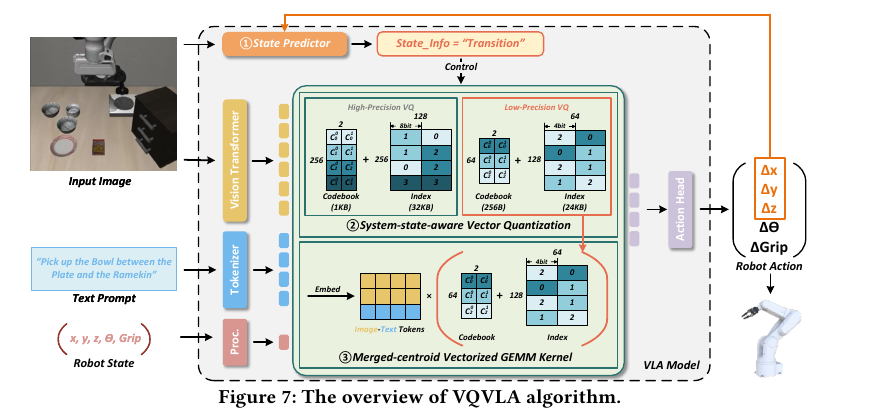
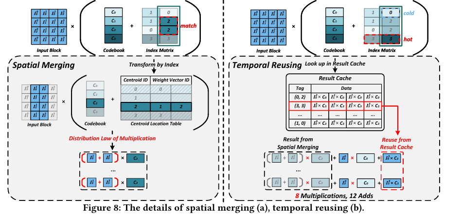

# 101. VQVLA：weight Vector Quantization 与 Centroid Reuse 详细阅读指南

**A Motion-Aware Vector Quantization Framework with Centroid Reuse for Efficient VLA Inference**  
Zhuoran Song, Haozhe Jiang, Chunyu Qi, Minnan Pei, Gang Li, Xiaoyao Liang, Haibing Guan  
固定版本：**arXiv:2607.24148v1，2026-07-27，14 页** · 阅读状态：`unread`  
整理日期：2026-10-06。下面的 p./pp. 均指本地 PDF 的物理页码。

- [本地固定版本 PDF](paper-arxiv-v1.pdf)
- [官方 arXiv / 版本记录](https://arxiv.org/abs/2607.24148v1) · [论文 HTML](https://arxiv.org/html/2607.24148v1)
- [返回 VLA paper library](../README.md)

这是用户所要的 **VQVLA：量化 VLA transformer weights，并设计 centroid-aware computation 与专用 accelerator**。它与 `060-vq-vla` 的 action tokenizer 是两篇不同论文。

PDF 使用 MICRO 2026 conference 模板，但 ISBN / conference DOI 仍为 placeholders，arXiv 页面没有提供足以确认正式出版的说明。因此这里固定引用 arXiv v1，不把版式本身当作正式 venue 核验结果。

本指南按“直觉 → 数值例子 → 公式 → 系统实现 → 实验与边界”展开。教学例子和补充推导会明确标记；成功率、延迟、能耗等均为作者报告，本地没有训练、推理或硬件复现。

## 1. 先抓住三层贡献

VQVLA 的出发点是：VLA 的 transformer backbone 有很多权重，也要做大量矩阵乘法。只把权重压小，可能减少内存读取，却未必减少实际计算。作者把表示方法、执行方式和硬件一起设计。

| 层次 | 具体做什么 | 解决的问题 |
|---|---|---|
| MotionVQ | 根据上一轮动作幅度，在两套 weight VQ 配置间选择 | 不同操作阶段对误差的容忍程度不同，没必要始终取高精度权重 |
| Merged-centroid Vectorized GEMM | 对相同 centroid 的运算先合并输入、再复用乘积 | 很多 weights 指向相同 codes，可以避免重复乘法 |
| Custom accelerator | 用 index processing、adder trees、PE arrays 和 result cache 执行上述流程 | 让不规则索引与复用真正转化成 latency / energy 收益 |

你可以把它理解成：**先让相似权重共享一份数值，再让共享数值所对应的计算也共享结果。** 机器人当前的操作阶段还决定本轮使用多精细的权重词典。

关键不是“动作变成 tokens”。这里的整数 index 用来代表模型内部的 weight vectors；机器人动作仍由原来的 VLA 输出路径产生。

## 2. Weight Vector Quantization：究竟存下了什么？

### 2.1 Scalar quantization 与 VQ 的区别

Scalar quantization 通常逐个表示权重，例如把一个浮点数映射到某个离散数值，再通过 scale / zero-point 等恢复近似值。

VQ 把多个相邻 weights 视为一个 vector，然后用一个 codebook centroid 代表整个 vector。以二维为例：

$$
w=(w_1,w_2),\qquad C=\{c_0,c_1,\ldots,c_{K-1}\},\quad c_j\in\mathbb R^2.
$$

标准 nearest-centroid 表达是：

$$
z=\arg\min_j\|w-c_j\|_2^2,\qquad\widehat w=c_z.
$$

**存储的是 index $z$ 和共享 codebook；使用时对应的 weight vector 是 $c_z$。** index 是一个编号，不是一个权重值。两个相邻编号也不保证两个 centroids 相近。

Sec. 2.2（pp. 2–3）介绍按 weight blocks / weight groups 使用 k-means clustering，核心目标可用下面的标准表达理解：

$$
\min_{C,\{z_i\}}\sum_i\|w_i-c_{z_i}\|_2^2.
$$

这是解释聚类的教学公式，不是说本文额外提出了一个新的 k-means objective。

### 2.2 一个最小的“共享权重”例子

**教学示意，不是论文实际 codebook。** 假设四个二维 weight vectors 是：

$$
(2.01,0.98),\quad(-1.02,3.03),\quad(1.99,1.01),\quad(-0.98,2.97).
$$

选择两个 centroids：

$$
c_0=(2,1),\qquad c_1=(-1,3).
$$

它们可被近似表示为 indices：

$$
[0,1,0,1].
$$

原来要存四个完整 vectors，现在存两份 centroid vectors，再存四个短 indices。这么小的例子只是演示表示方式；真实压缩比例还要把 codebook overhead 算进去。

注意发生了两件不同的事：第一，原始 weights 被近似，产生 quantization error；第二，近似后的第一与第三个 vectors 完全相同，第二与第四个完全相同，为计算复用创造了机会。

## 3. VQ[256,2,256] 与“4.125 bits”怎样理解？

### 3.1 三个数字的含义

论文把配置记作 $VQ[m,v,K]$：

- $m$：weight block 的边长，block 为 $m\times m$。
- $v$：每个 weight vector 含几个 scalar weights。
- $K$：codebook 中 centroids 的数量。

所以 **VQ[256,2,256]** 表示 256×256 block、2 个 weights 为一个 vector、256 个 centroids；**VQ[128,2,64]** 则是 128×128 block、2 个 weights 为一个 vector、64 个 centroids。

$K=256$ 时一个 index 需要 8 bits；$K=64$ 时需要 6 bits。由于一个 index 同时代表两个 weights，index cost 分摊到每个 scalar weight 分别是 4 bits 和 3 bits。

### 3.2 Codebook 也要存：不能只算 indices

下面是**用于解释本文平均 bitwidth 的存储推导**。假设一个 $m\times m$ block 共享一份含 $K$ 个 $v$ 维 centroids 的 codebook，每个 centroid scalar 使用 $b_c$ bits，则：

$$
\#\text{vectors}=\frac{m^2}{v},\qquad
B_{\mathrm{indices}}=\frac{m^2}{v}\log_2K,\qquad
B_{\mathrm{codebook}}=Kvb_c.
$$

平均每 scalar weight 的 bits 为：

$$
b_{\mathrm{eff}}=\frac{\log_2K}{v}+\frac{Kvb_c}{m^2}.
$$

按 $b_c=16$ 计，与 Fig. 7 的 high / low codebook 容量 1 KB / 256 B 相符：

$$
b_{\mathrm{high}}=\frac8{2}+\frac{256\cdot2\cdot16}{256^2}=4.125,
$$

$$
b_{\mathrm{low}}=\frac6{2}+\frac{64\cdot2\cdot16}{128^2}=3.125.
$$

这解释了 Sec. 7.2（p. 8）报告的 4.125 / 3.125 average bits。它们是**压缩表示的平均 storage cost**，不是所有实际 arithmetic 都使用 4-bit / 3-bit 数值。

这个公式还依赖 codebook 的共享范围；若每个 group 各存一份 codebook，不能原样套用。真实部署还要考虑 padding、alignment、metadata、两套量化包，以及其他模型模块的存储。

**原图标注需注意：** Fig. 7 的 low-precision index 图上写了 4bit / 24KB，但 64 个 centroids 需要 6-bit indices，且 128×64 个 6-bit indices 为 6 KB。图中标注与正文配置不完全一致。阅读 bitwidth 时以上述正文配置为准；复现 packed layout 时需确认作者实际实现。

### 3.3 两套 weights 与每次读取的数据量，是不同指标

MotionVQ 预先生成 high / low 两套 codebooks 和 index matrices。每次根据状态取用一套，因此本次读取可以更少；但完整部署需要保存或提供两套表示。

不能把“本轮读取约 3–4 bits/weight”直接当成“整个模型只需同样的单套磁盘空间”，也不能把论文的 weight traffic saving 自动换成 total VRAM saving。

## 4. MotionVQ：为什么看上一轮动作就能选精度？



图摘自本地 PDF p. 6。正文算法在 Sec. 4（pp. 4–5）。

### 4.1 作者观察到的区别

当机器人靠近目标做抓取、放置等精细调整时，动作幅度通常较小；远离目标进行转移时，幅度通常较大。作者据此把运行过程分成：

| 状态 | 作者的典型解释 | 选择的 weight set |
|---|---|---|
| Execution state | 接近物体，做细小、精确的操作 | High precision，256 centroids |
| Transition state | 移动到另一个位置，运动较粗 | Low precision，64 centroids |

Fig. 4（p. 4）展示动作幅度与物体距离的相关性；Fig. 5（p. 4）在 OpenVLA-OFT / LIBERO 中对两种阶段加入不同程度的 noise，transition 的成功率更耐扰动。这是状态划分的经验支持，不是普遍的物理规律或安全证明。

### 4.2 State predictor 的计算

输入是**上一轮 VLA inference 输出的 3D action**，不是一个显式的 contact detector 或独立 world model：

$$
D=\sqrt{A_x^2+A_y^2+A_z^2}.
$$

然后比较阈值 $T_d$：

$$
\text{precision}(D)=
\begin{cases}
\text{High},&D\leq T_d,\\
\text{Low},&D>T_d.
\end{cases}
$$

直觉是“小幅动作更可能在精细执行阶段，需要更精细的权重表示”。但 $D$ 是运动代理信号，不能直接等同于当前距离、真实接触、任务风险或 quantization sensitivity。

### 4.3 阈值如何得到？

Sec. 7.4（pp. 11–12）写明：从每个 benchmark 随机取 10% 数据作为 calibration set，选择阈值，在其余 90% 上评价。搜索 $T_d=0.4$ 到 1.0，默认选择 **0.8**；继续降低到 0.6 时成功率明显下降。

因此 MotionVQ 不是一个完全无需任务数据的 threshold recipe。0.8 依赖本文 action representation / normalization，不能直接解释成 0.8 米并移植给另一套模型。

注意参数方向：阈值更小，更多 $D$ 会落入 $D>T_d$，于是更多步骤使用 low precision，memory savings 增加，但成功率风险也增加。

### 4.4 会在哪些场景失效？

**以下是阅读判断。** 大幅动作也可能发生在碰撞、快速截获或危险接触附近；小幅动作可能只是无害地等待；上一轮是 transition，不意味着下一轮仍是 transition。旋转与 gripper 的精细需求也不能仅由 XYZ norm 描述。

所以应理解成“一个轻量、经本文实验验证的状态 proxy”，而不是“动作大就一定不敏感”。

## 5. Spatial Merging：用分配律减少乘法

### 5.1 先把矩阵乘法写成 vector 形式

设 input activation row 为 $x=(x_0,\ldots,x_{m-1})$；一个输出 weight group 含 $v$ 个 output channels。第 $k$ 个 weight vector 的 index 为 $z_k$，近似 weight vector 就是 $c_{z_k}\in\mathbb R^v$。

该 output group 的结果为：

$$
y=\sum_{k=0}^{m-1}x_kc_{z_k}\in\mathbb R^v.
$$

把指向相同 centroid $c_j$ 的位置放进集合 $S_j=\{k:z_k=j\}$，则可重排为：

$$
y=\sum_j\left(\sum_{k\in S_j}x_k\right)c_j.
$$

这正是 Sec. 5.1 / Eq. (1)（p. 5）的思路：**相同 centroid 对应的 inputs 先加起来，再与 centroid 相乘。**

### 5.2 一个完整的二维数值例子

**教学例子。** 使用前面的 codebook：

$$
x=(1,2,3,4),\quad c_0=(2,1),\quad c_1=(-1,3),\quad z=[0,1,0,1].
$$

直接计算：

$$
y=1c_0+2c_1+3c_0+4c_1.
$$

每个 scalar input 乘一个二维 vector，需要 2 次 scalar multiplication，四个位置共 **8 次乘法**。结果为：

$$
y=(2,1)+(-2,6)+(6,3)+(-4,12)=(2,22).
$$

先按 centroid 聚合：

$$
s_0=1+3=4,\qquad s_1=2+4=6,
$$

$$
y=s_0c_0+s_1c_1=4(2,1)+6(-1,3)=(2,22).
$$

现在只有 **4 次 scalar multiplication**，但增加了聚合输入的 additions 与索引处理。若输入有很多位置，而只访问少量 centroids，乘法节省会更大。

这里没有在 VQ 之后再改变数学结果：在精确 arithmetic 下，两个路径得到相同的 quantized GEMM。实际浮点运算改变求和顺序，仍可能有 rounding 差异。

### 5.3 是“索引完全一样”，不是“权重看起来相近”

它可以精确合并，是因为 VQ 后某些 weight vectors **已经被同一个 centroid 代替**。原始 $(2.01,0.98)$ 与 $(1.99,1.01)$ 只是近似，不能无代价地当成完全相同。

因此，误差来自把原始 weights 映射成 centroids；计算复用则在这个已量化的表示上利用相同值。

## 6. Temporal Reusing：跨输出组复用已经算好的乘积



图摘自本地 PDF p. 6，文字解释在 Sec. 5（p. 5）。

### 6.1 与 spatial merging 的区别

Spatial merging 是：**同一个 output group 里，不同 input positions 指向同一个 centroid**，可以先把 inputs 加起来。

Temporal reusing 是：**处理另一个 output group 时，同一个 input position 又需要乘同一个 centroid**，可以取出已有乘积。

例如某一 activation 为 $x_2=3$，已经算过：

$$
x_2c_0=3(2,1)=(6,3).
$$

若下一个输出组同样在这个位置引用 $c_0$，这份 $(6,3)$ 可以再用。若换成 $x_3=4$，或者换成不同 codebook 中同编号的 code，不能沿用同一结果。

### 6.2 Result cache 存什么？

Sec. 5.2（p. 5）的 tag 包括 **centroid ID + weight vector ID / 对应输入位置**，data 保存这些 inputs 与 hot centroids 的 products。一个条目还可以覆盖当前 input block 的多行。

hot centroids 通过 compressed weight matrices 中的 index occurrence frequencies 离线 Top-k 选择，不靠当前 environment-specific activations 来挑选。因此这里要区分：**weight-index frequency 分析**与**用 benchmark data 选择 MotionVQ threshold**是两件事。

论文里的 temporal 指“按计算顺序跨列复用”，并不是跨 robot timesteps 缓存整轮 VLA 结果。换一张图、换一轮输入或换 precision set 时，activations / codebook 可能改变，旧乘积不能凭相同 centroid ID 继续使用。

### 6.3 为什么不为所有 centroid 都预计算？

codebook 中不同 codes 的使用频率不均匀。Fig. 6（p. 4）展示 hot / cold indices：有些经常使用，有些很少使用。为所有 activation–centroid pairs 都建大表，会增加计算、cache 容量与访问开销。

VQVLA 重点缓存 hot codes 的结果，目标是在复用收益和存储开销之间取得平衡。是否有收益还依赖 index 分布、输入长度与硬件访问成本。

## 7. 为什么还需要 custom accelerator？

数学上省了乘法，并不意味着 GPU wall-clock time 一定变短。还增加了 index traversal、分组、聚合、cache lookup、动态 weight fetching 等操作；它们往往是不规则的访问和控制逻辑，不像 dense GEMM 那样容易充分使用 Tensor Cores。

Sec. 6（pp. 5–8）用专门模块处理这些工作：

| 模块 | 职责 |
|---|---|
| State Predictor | 计算 $D$，选择 high / low set |
| Index Processing Engine / IPUs | 生成 centroid location tables，组织哪些输入要合并或复用 |
| Spatial Merging PE Array + Adder Tree | 聚合 inputs，再乘 centroid |
| Temporal Reusing PE Array + Result Cache | 查询可用乘积，miss 时补算 |
| Buffers + Accumulation Unit | 缓存 indices、codebooks、输入和中间结果，并累加输出 |

它不是只让一个普通 GEMM 接受低比特 weights，而是围绕 **codebook–index representation** 重排数据流。32-bit PEs 等硬件配置也说明：平均 3–4 bits/weight 不等于所有算术都变成 INT3/INT4。

Table 1（p. 11）列出 1.5 MB result cache、7 MB index-processing SRAM，以及两组 24×256 PEs；这些资源也有 area / power 成本。选择多少 cache、怎样分配 spatial/temporal PEs，是系统设计的一部分。

## 8. 从 offline 到 runtime，把完整流程串起来

1. **Offline weight VQ**：为目标 transformer weights 准备 high / low 两套 codebooks 与 index matrices。
2. **Offline 配置准备**：分析 indices 的频率，确定 hot centroids；用 calibration data 选择 motion threshold。
3. **Runtime state prediction**：根据上一轮 VLA action 的 XYZ 幅度，预测本轮 execution / transition state。
4. **Fetch selected representation**：读取对应 precision set 的 codebooks 与 indices。
5. **Index processing**：组织 spatial merging / temporal reusing 所需位置表。
6. **Compressed-domain GEMM**：先聚合重复 centroid 对应的 inputs，再计算、缓存和复用乘积。
7. **正常输出动作**：将 transformer 输出交给原来的 VLA 后续模块，形成 action / action chunk，执行后再进入下一轮。

这里没有要求 runtime 重新训练 codebook，也没有要求每轮把全量 weights 还原成 dense floating-point matrix 再做原 GEMM。后者是传统 VQ execution path；本文的加速器试图直接对压缩表示进行运算。

## 9. 实验设置：先固定模型、任务与分母

### 9.1 五种 workloads（Sec. 7.1，p. 8）

| VLA model | Benchmark | Task suites | 论文保留的 action chunk length |
|---|---|---|---:|
| OpenVLA | LIBERO | Spatial、Object、Goal、10 | 本表没有另列 chunk length |
| OpenVLA-OFT | LIBERO | Spatial、Object、Goal、10 | 8 |
| RDT | ManiSkill | PickCube、PushCube、PegInsertionSide、StackCube | 8 |
| $\pi_0$ | LIBERO | Spatial、Object、Goal、10 | 5 |
| GR00T | LIBERO | Spatial、Object、Goal、10 | 16 |

因此这是五种模型、各四个 task-suite entries，共 20 个 model–suite 条件；不能把它说成五种任务或四个真实机器人实验。这里的 LIBERO / ManiSkill 结果来自 simulation benchmark。

Table / figure 中的 success rate 应配合具体 evaluation episodes 解释。但固定 v1 没有充分列明每个 model–suite 的 trials、random seeds 和置信区间，不宜自行用别的 LIBERO 论文的 500 episodes 补上它的分母。

### 9.2 GPU baseline 的 precision（Sec. 7.3，p. 9）

| 模型 | 作者使用的 GPU default precision |
|---|---|
| OpenVLA | FP16 |
| OpenVLA-OFT | FP32 |
| RDT、$\pi_0$、GR00T | BF16 |

作者报告使用 Tensor Core 和 FlashAttention 2。因此 weight memory reductions 的 baseline 并不全是同一种 precision；不能把 79.4% 简单理解为“所有模型统一从 FP32 变成 INT4”的结果。

### 9.3 Calibration 的信息与缺口

Threshold exploration 从每个 benchmark 取 10% 数据用于 calibration、90% 用于剩余评价（pp. 11–12）。正文没有充分给出这里的 data unit 是 episodes、trajectories 还是其他 sample unit，以及每个 benchmark 的绝对数量。

这项 split 支持作者报告的 threshold generalization 结果，但不足以自行重建完整 paired evaluation protocol。原文也没有提供足够细的全部 weight VQ preparation 超参数；阅读包不据此声称训练/复现成本为零。

## 10. Algorithm 结果：任务表现、traffic 与乘法是三种指标

### 10.1 Fig. 14 的主要读数（pp. 8–9）

| 指标 | 作者报告 | 具体涵义 |
|---|---|---|
| Task success | 作者写平均下降约 2.5% | 原文未明确相对百分比或 percentage points；并非完全无损 |
| Weight retrieval memory consumption | 平均减少 79.4% | 获取 weights 的 memory access / traffic saving，不是完整 GPU VRAM 或模型磁盘体积 |
| Multiplications | 平均减少 54.8% | centroid-aware GEMM 的乘法计数变化，不是所有操作总数减半 |

作者还举出 multiplication reduction 的差异：OpenVLA / LIBERO-Object 为 **71.4%**，RDT / ManiSkill-StackCube 为 **52.2%**。说明收益依赖 task / workload，而不是统一常数。

“平均成功率下降 2.5%”保留原文写法：没有把相对百分比 / percentage points、所有 aggregate weighting 与区间充分列明，因此不应自行换算、宣称统计等价、所有任务仅下降 2.5 points，或所有用户都能接受这个损失。

### 10.2 Fig. 21 的 below 1.8% 不要与前面的均值混用

Sec. 7.4（pp. 11–12）在阈值选择后报告：剩余 unseen test data 的 success-rate degradation 低于 1.8%。该段 design exploration 使用 OpenVLA、OpenVLA-OFT、RDT 三种模型，而 Fig. 14 的总体 workload 包含五种。

所以 1.8% 与 2.5% 是不同段落、范围和 protocol 的读数；不能挑一个替换另一项，也不能断言它们来自同一 paired run。

### 10.3 为什么减少乘法还要看 additions 和 accesses？

Spatial merging 需要加和 inputs；temporal reusing 需要查 result cache；两者都需要处理 indices。因此“54.8% fewer multiplications”只是一个机制指标，最后是否更快取决于实际执行成本。

这也是本文把 algorithm evaluation 和 architecture evaluation 分开的原因。

## 11. 硬件性能：6.5× 由什么证据支持？

### 11.1 Methodology（Sec. 7.3，p. 9）

| 项目 | 作者实际采用的评估方式 |
|---|---|
| VQVLA latency | 自建 cycle-level simulator，采集计算与 buffer accesses |
| Off-chip memory timing | 集成 Ramulator，参考 Scale-Sim 的模拟方法 |
| Area / power | Verilog 实现，Synopsys Design Compiler 综合 |
| Synthesis 设置 | 28 nm、500 MHz；为与 A100 比较，area / power 按参考方法 scale 到 7 nm |
| Memory configuration | 对齐 A100：80 GB HBM2e，peak bandwidth 1935 GB/s |
| Off-chip access energy | 按 3.9 pJ/bit 估计 |
| Dadu-Corki / LUT-DLA | 在同一 cycle simulator 中重新实现 |
| CodeGEMM / ShiftAddLLM | 使用官方开源实现评价 |

这是 **GPU baseline measurements + simulated custom hardware + synthesized / scaled area-power estimates** 的组合。不能把 VQVLA 结果称为 fabricated chip、真实 A100 kernel 或 commodity edge device 的实测性能。

### 11.2 主要 speed / energy 数字与范围

| 结果 | 作者报告 | 原文位置 |
|---|---|---|
| VLA inference speedup vs A100 | 平均 6.5× | Fig. 15，p. 10；Sec. 7.3，p. 9 |
| vs LUT-DLA | 1.9× | 同上 |
| vs CodeGEMM | 3.3× | 同上 |
| vs ShiftAddLLM | 4.3× | 同上 |
| Energy efficiency vs GPU | 75.5× | Fig. 17 / Sec. 7.3，p. 10 |
| VQVLA power / A100 power | 6.4% | Sec. 7.3，p. 10 |
| Effective end-to-end per-action latency | 30–60 ms | Fig. 18，p. 10 |
| Per-action improvement vs Dadu-Corki | 2.8× | Fig. 18，p. 10 |
| VQVLA-Corki vs Dadu-Corki alone | 6.0× | 同上 |

p. 11 的 Table 1 列出 architecture area / power breakdown，总计 51.15 mm²、19.28 W；引用这些数值时应同时保留前面的 synthesis / process-scaling methodology，不把它们称为芯片实测。

### 11.3 最需要记住的反例：GPU-VQVLA

Fig. 15 对比了 GPU-A100、GPU-VQVLA 和 VQVLA architecture。Sec. 7.3（p. 10）写：**GPU-VQVLA 相对 GPU-A100 有 45.2% performance loss**。

原因包括不规则 index traversal / comparisons 的 GPU 执行效率低，以及 state prediction、weight loading、spatial merging、temporal reusing 等多个 kernel 难以充分重叠。

这一读数说明：**直接把本文算法搬到 GPU，并没有获得 headline acceleration。** 原文使用 performance loss 这一表述，不宜未经确认将它精确换算为“latency 增加 45.2%”或“throughput 减少 45.2%”。

### 11.4 30–60 ms 是摊到每个动作的 latency

论文定义：

$$
L_{\mathrm{per\ action}}=
\frac{L_{\mathrm{VLA\ inference}}+L_{\mathrm{robot\ control}}+L_{\mathrm{communication}}}
{\mathrm{action\ chunk\ length}}.
$$

因此它是 **effective / amortized per-action latency**。若某模型一次预测 8 个未来动作，把一个 chunk 的 end-to-end 时间除以 8，得到的数值不等于每 30–60 ms 都处理一张新图像并重新决策。

这个定义也不同于只测 transformer GEMM 的 kernel time。比较 speedup 时必须使用同一种 latency 范围与 chunk 设置；不能把 6.5×、2.8× 和 6.0× 直接相乘。

## 12. Ablations：收益来源有没有分别验证？

Fig. 19（p. 11）在 OpenVLA-OFT 上比较 VQVLA 与 VQVLA-plain：

- 动态取用 high / low weight set：报告对应 off-chip memory access latency 约 3.8× reduction。
- Spatial merging：报告对应部分 latency 约 1.5× reduction。
- Temporal reusing：报告对应部分 latency 约 1.6× reduction。

这是不同部分的收益定位，不能把三项视为独立端到端 speedups 并机械相乘。

Design exploration（pp. 11–12）还选择了 1.5 MB result cache、3-stage adder tree，以及 spatial-to-temporal PE ratio 1:1。更大的 cache 不总有更多收益，还增加 area / power。

阅读这些结果时要问：换了 centroid repetition pattern、input length、模型或 bandwidth，这些最佳配置是否仍合适？本文的参数探索不能证明它们是所有 workloads 的普遍最优值。

## 13. 一点数学理解：为什么 weight MSE 和动作风险不同？

这一节是**补充推导与 FYP 阅读判断，不是本文证明的理论**。

对一个 linear layer，原输出与量化输出是：

$$
Y=XW,\qquad\widehat Y=X\widehat W,
\qquad E=\widehat W-W.
$$

所以：

$$
\widehat Y-Y=XE,\qquad
\|\widehat Y-Y\|_F\leq\|X\|_2\|E\|_F.
$$

即使 weight error $E$ 固定，layer output error 仍随输入 activations $X$ 变化。经过后续网络与控制环境，同样的输出扰动也可能造成不同后果。

例如远离障碍时，位置偏差 1 mm 可能无关紧要；插入细孔时，1 mm 可能已经失败。MotionVQ 用 action magnitude 近似识别这样的状态差异，但没有直接计算上述激活敏感性或真实 task cost。

因此，本篇对 FYP 的价值是两条线索：**量化精度可以随运行状态变化；可压缩的权重表示也能重新组织运算。** 但 motion magnitude 不是已被证明足够准确的 control-risk estimator，custom accelerator 的收益也不是现成 Fast-WAM GPU speedup。

## 14. 分时阅读路线与关键定位

| 用时 | 按顺序读什么 | 读完留下什么 |
|---|---|---|
| 20 分钟 | README §§1–6；PDF Abstract p. 1 → Fig. 1 p. 2 → Fig. 7–8 p. 6 → Fig. 14 p. 9 → Fig. 15 / GPU-VQVLA 段 p. 10 | 区分 MotionVQ、spatial merging、temporal reusing；用数值例子解释省乘法；记住 GPU 与专用硬件结果不同 |
| 60–90 分钟 | PDF Sec. 2.2 pp. 2–3 → Secs. 3.2–4 p. 4 → Sec. 5 p. 5 → Secs. 7.1–7.3 pp. 8–10 | 写清 VQ[m,v,K]、存储预算、状态公式、cache tag；整理三类指标与硬件证据 |
| 2–3 小时 | PDF Sec. 6 pp. 5–8 → Table 1 / Fig. 19 p. 11 → Sec. 7.4 pp. 11–12；README §§11–13 | 核对 additions/cache/index overhead；解释 per-action latency；完成 Questions 与 Meeting Card |

| 想查的内容 | 本地 PDF 位置 |
|---|---|
| VQ 表示与配置参数 | Sec. 2.2，pp. 2–3 |
| Transformer latency breakdown | Fig. 3 / Sec. 3.1，p. 3 |
| Motion 与距离、noise tolerance | Figs. 4–5，p. 4 |
| Hot centroid frequency | Fig. 6，p. 4 |
| State predictor 与两套 precision | Sec. 4，pp. 4–5；Fig. 7，p. 6 |
| Spatial / temporal reuse 公式和 cache tags | Sec. 5，p. 5；Fig. 8，p. 6 |
| Accelerator 总体结构 | Fig. 9，p. 6 |
| PE arrays、adder tree、IPUs | Sec. 6，pp. 7–8；Figs. 10–13 |
| Models、benchmarks、chunk lengths、bitwidth | Secs. 7.1–7.2，p. 8 |
| Success、weight traffic、multiplication reduction | Fig. 14 / Sec. 7.2，p. 9 |
| Simulator、synthesis、baseline setup | Sec. 7.3，p. 9 |
| Speed / energy / per-action latency | Figs. 15–18，p. 10 |
| Area-power breakdown、component ablation | Table 1 / Fig. 19，p. 11 |
| Cache / adder-tree / threshold exploration | Sec. 7.4，pp. 11–12；Figs. 20–21，p. 12 |

正文至 p. 13 的 conclusion，references 在 pp. 13–14。本地固定 v1 没有额外 experimental appendix。

## 15. Reading Questions（留给你独立回答）

1. 为什么一个 8-bit index 可以分摊为约 4 bits/weight？还需要计算什么存储开销？
2. 如果不改变 dense GEMM execution path，只把 weights 用 codebook 压缩，能减少哪些成本？哪些不会自动减少？
3. 用另一个数值例子说明 spatial merging，并标出新增的 additions / index overhead。
4. Temporal cache hit 除了相同 centroid ID，还要求哪些信息一致？为什么不能直接跨 robot timesteps 复用？
5. 每个 group 使用独立 codebook 时，跨 group centroid reuse 需要额外满足什么条件？
6. MotionVQ 为什么用上一轮 action？在 transition→contact 的边界可能发生什么预测错误？
7. Threshold 0.8 的 normalization / units 是什么？更换 action representation 后应如何解释这个阈值？
8. Fig. 14 的 2.5% 和 threshold exploration 的 below 1.8%，分别对应哪个范围与数据 split？
9. 79.4% weight traffic reduction 能否代表模型文件、total VRAM 和端到端 latency 同幅改善？
10. 54.8% fewer multiplications 为什么可能同时伴随 GPU 性能下降？
11. 30–60 ms effective per-action latency 与 fresh-observation decision latency 有什么区别？
12. Custom hardware 的 6.5× speedup 依赖哪些 memory / process / pipeline assumptions？
13. 如果目标是 Fast-WAM 的现有 GPU 部署，哪部分是可迁移的机制线索，哪部分需要重新证明？
14. 你最想向作者确认的 packed layout、trial 分母或 sensitivity proxy 问题是什么？

## 16. Meeting Card（留空）

- 我理解的目标问题：
- 一句话机制：
- 一个 codebook / centroid reuse 数值例子：
- 两套 precision 配置与平均 bits 的计算：
- Runtime state signal 与 threshold：
- Success rate 的 model / suite / trials 口径：
- 最强证据及 PDF 定位：
- GPU-VQVLA 与 custom architecture 的差别：
- Per-action latency 的分子与分母：
- 最关键的 simulator / synthesis assumptions：
- 我发现的复现信息缺口：
- 对 FYP 已覆盖的部分：
- 仍需讨论或验证的问题：

## 17. 引用信息

```bibtex
@misc{song2026motionawarevqvla,
  title={A Motion-Aware Vector Quantization Framework with Centroid Reuse for Efficient VLA Inference},
  author={Song, Zhuoran and Jiang, Haozhe and Qi, Chunyu and Pei, Minnan and Li, Gang and Liang, Xiaoyao and Guan, Haibing},
  year={2026},
  eprint={2607.24148},
  archivePrefix={arXiv},
  primaryClass={cs.AI},
  url={https://arxiv.org/abs/2607.24148v1}
}
```

本阅读包保留固定原 PDF；两张 PNG 为论文原图的阅读摘取。所有 reported performance 都按论文证据范围呈现，不表示本地或实物硬件复现。
