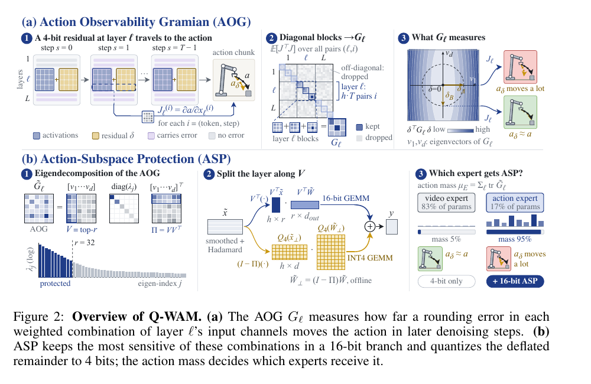
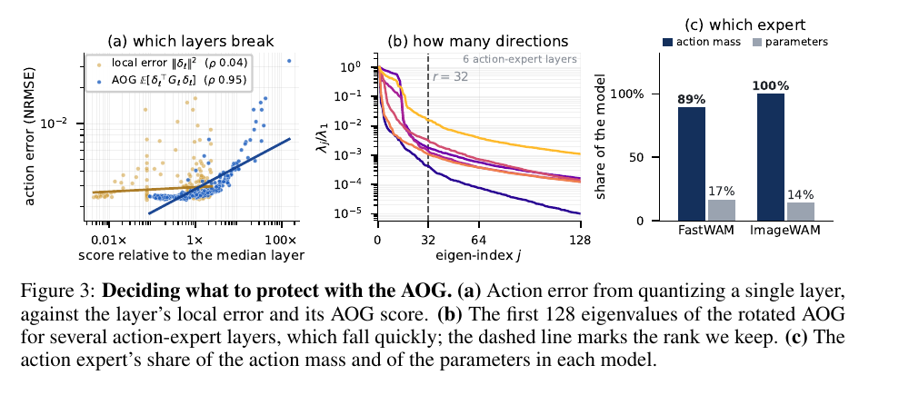

# 25. Q-WAM：详细易懂的阅读讲解

**Q-WAM: 4-Bit Quantization of World Action Models with Action-Subspace Protection**  
固定版本：**arXiv:2609.33269v1** · 22 页 · 讲解更新：2026-10-05  
分类：WAM PTQ / final-action sensitivity / activation subspace protection

[本地 v1 PDF](paper-arxiv-v1.pdf) · [arXiv v1](https://arxiv.org/abs/2609.33269v1) · [官方 HTML 全文](https://arxiv.org/html/2609.33269v1) · [WAM 目录](../README.md)

以下依据本地固定 v1；页码按 PDF 物理页编号。实验数字均为论文报告，本地未运行量化、训练或 benchmark。

**Q-WAM 的核心想法是：量化误差是否危险，取决于它沿哪个方向改变最终动作；把少量最危险的方向保留在 16-bit，其余主要计算使用 W4A4。**

它与你刚读的 QuantWAMs 有一个明显区别。QuantWAMs 会保留选中的 channel、升级选中的 Linear、保护选中的 denoising step。Q-WAM 重点保护的是 **一个 Linear 输入空间中，由许多 channels 加权组成的方向**。

下面先用一个二维例子建立直觉，再逐步接上 AOG、ASP、expert 选择和实验。教学数字不是论文实测。

---

**先确认 Q-WAM 希望保住的输出是什么。**

机器人在一次 control call 中接收 observation 和 instruction，生成一个 action chunk。它包含未来一小段时间的多个动作，可以展平成向量：

\[
a\in\mathbb R^m.
\]

这个 chunk 由多次 denoising 生成。论文用 flow-matching velocity 和 Euler update 表示：

\[
a^{(s+1)}
=
a^{(s)}
+\eta_s v_\theta(a^{(s)},\tau_s,z),
\qquad a=a^{(T)}.
\]

变量分别是：

- \(a^{(0)}\)：初始噪声动作；
- \(v_\theta\)：网络预测的 velocity；
- \(\eta_s\)：当前积分步长；
- \(z\)：observation/instruction 编码得到的 conditioning；
- \(T\)：生成一个 chunk 所需的 denoising steps。

对 action denoiser 来说，同一套网络权重会在多个 steps 重复使用。量化在一个中间位置产生误差之后，它会经过本 step 剩下的网络，还可能改变后续 steps 的输入。

Q-WAM 希望：

\[
a_{\mathrm{quantized}}\approx a_{\mathrm{bf16}}.
\]

这是 **final-action fidelity**。它的 calibration 目标是接近模型原本生成的动作，而不是直接最大化环境 reward，也不是拟合 ground-truth actions。

机器人执行动作后再观察，属于外层 closed loop。论文会实际评价这个闭环成功率，但 AOG 的求导范围是一段 action chunk 的生成过程，没有展开机器人环境中的多轮控制。

---

**为什么把中间误差变小，还不够？**

假设中间 activation 只有两个 channels：

\[
x=(x_1,x_2).
\]

为了说明问题，假设最终动作的某个坐标是：

\[
a=10\frac{x_1+x_2}{\sqrt2}.
\]

比较两个同样大小的误差：

\[
\delta_A=0.1\frac{(1,1)}{\sqrt2},
\qquad
\delta_B=0.1\frac{(1,-1)}{\sqrt2}.
\]

二者的欧氏长度相同：

\[
\|\delta_A\|=\|\delta_B\|=0.1.
\]

但动作变化完全不同：

| 教学误差 | 两个 channels 怎样变化 | 最终动作变化 |
|---|---|---:|
| \(\delta_A\) | 同时增加 | \(\Delta a=1\) |
| \(\delta_B\) | 一个增加、一个减少 | \(\Delta a=0\) |

如果只看 local MSE，两者一样；如果看最终动作，前者危险，后者在这个教学模型中没有影响。

原因是模型敏感于 **两个 channels 的和**，而不敏感于它们的差。

于是，我们得到两个方向：

\[
v_+=\frac{(1,1)}{\sqrt2},
\qquad
v_-=\frac{(1,-1)}{\sqrt2}.
\]

它们都不是某个原始 channel，而是 channels 的加权组合。

这个例子解释了论文最重要的区分：

**activation magnitude、quantization error magnitude、final-action sensitivity 是三个不同的量。**

- activation 大：这个特征数值大；
- rounding error 大：量化前后差得多；
- action sensitivity 大：很小的内部变化也会显著改变动作。

Smoothing 和 rotation 主要改善 outliers 与量化动态范围，但不能保证所有剩余误差都落在动作不敏感的方向上。

---

**“Action subspace”仍然位于 activation 空间。**

这里特别容易误解。

Q-WAM 的 action subspace 不是机器人 action vector 中选出的几个关节，也不是只保护某些动作时间点。它是：

> 某个 Linear 的输入特征空间中，对最终生成动作最敏感的若干方向所张成的子空间。

名字里的 action，说明这些方向是依据最终 action 的变化选出来的；不是说它们位于机器人的物理动作空间。

在上面的二维例子中：

\[
q_+=v_+^\top x=\frac{x_1+x_2}{\sqrt2},
\]

就是敏感方向上的坐标。保护 \(q_+\)，与保护 \(x_1\) 或 \(x_2\)，是不同的操作。

实际模型可能有 1024、3072 或 4096 个 input channels，一个方向可能同时混合很多 channels，系数也可能正负相间。我们通常不能直接赋予它“负责抓取位置”之类的语义。

---

**第一个工具 AOG：把最终动作敏感性写成一个矩阵。**

先看一个中间位置：

\[
J=\frac{\partial a}{\partial x}.
\]

这个 Jacobian 表示：

> 输入 activation 各维稍微变化，最终 action chunk 各维会怎样变化？

如果输入维数为 \(d\)，输出 action chunk 维数为 \(m\)，则：

\[
J\in\mathbb R^{m\times d}.
\]

对足够小的扰动：

\[
\Delta a\approx J\delta.
\]

因此，平方动作误差近似为：

\[
\|\Delta a\|^2
\approx
\delta^\top J^\top J\delta.
\]

这就引出了 AOG 的基本结构：

\[
G=J^\top J.
\]

\(G\) 是 \(d\times d\) 的矩阵，位于该 Linear 的 input-channel 空间。它把普通的欧氏误差长度，变成最终动作诱导的误差代价：

\[
\boxed{\text{局部预测动作损伤}\approx\delta^\top G\delta.}
\]

因为任意 \(\delta\) 都有：

\[
\delta^\top G\delta=\|J\delta\|^2\ge0,
\]

所以 \(G\) 是 positive semidefinite，可以使用非负 eigenvalues 分析敏感方向。

在前面的教学例子中：

\[
J=\frac{10}{\sqrt2}[1,1],
\qquad
G=50
\begin{bmatrix}
1&1\\
1&1
\end{bmatrix}.
\]

它在 \(v_+\) 方向上的 eigenvalue 为 100，在 \(v_-\) 方向上为 0。

因此：

\[
\delta_A^\top G\delta_A=1,
\qquad
\delta_B^\top G\delta_B=0.
\]

AOG 不仅告诉我们两个 channels 都重要，还保留了二者共同变化的关系。仅保留两个 diagonal channel scores，会丢掉这个例子中“和与差”的区别。

如果你熟悉 Hessian，还可以再理解一层。定义动作偏差目标 \(F(\delta)=\tfrac12\mathbb E\|A(x+\delta)-A(x)\|^2\)。在 \(\delta=0\) 时，比较的是模型与它自己，动作差恰好为零，因此该点的 Hessian 是 \(\mathbb E[J^\top J]\)。这是 Appendix A.1 的结论，不需要假设模型已经达到 training-loss optimum；也不能把它直接当成环境 reward 的 Hessian。

---

**真实模型需要对不同 tokens、steps 和 calibration inputs 汇总。**

同一个 Linear 会在不同位置执行。论文用：

\[
i=(\text{token},\text{denoising step})
\]

表示 token–step pair。

该位置的 Jacobian 是：

\[
J_\ell^{(i)}
=
\frac{\partial a}{\partial x_\ell^{(i)}}.
\]

它包括这个位置之后的网络与剩余 denoising steps，不只是本层输出。

整体一阶动作变化是：

\[
\Delta a\approx
\sum_{\ell,i}
J_\ell^{(i)}\delta_\ell^{(i)}.
\]

平方之后，本来会产生不同 layers、tokens、steps 之间的 cross terms。论文在近似零均值、不同位置 residual 不相关、residual 与 Jacobian 不相关，以及一层各 token–step pairs 共享误差分布等工作假设下，把它简化为：

\[
\mathbb E\|\Delta a\|^2
\approx
\sum_\ell
\mathbb E[
\delta_\ell^\top G_\ell\delta_\ell],
\]

\[
\boxed{
G_\ell
=
\mathbb E\left[
\sum_i
J_\ell^{(i)\top}J_\ell^{(i)}
\right].
}
\]

这就是论文的 **Action Observability Gramian（AOG）**。

可以把 Observability 理解为：从最终动作输出中，能看到哪些内部扰动的影响。这里不是在判断机器人环境状态是否具有传统控制论意义上的可观测性。

同一个 Linear 最终得到一个汇总的 AOG，用来建立固定的保护子空间，不是在部署时每个 step 都重新求一次。

这些近似有实际边界。相邻 denoising steps 的 activation 相似，rounding residual 也可能相关。Appendix A.2 明确承认这一点，不能将分层相加描述成精确的全模型误差分解。

---

**论文怎样检查 AOG 是否有用？**

Figure 3a 在 Fast-WAM 的 action expert 上做了一个很直接的诊断：

1. 一次只把一个 Linear 量化为 W4A4；
2. 其余部分保持全精度；
3. 测量最终 action chunk 的 NRMSE；
4. 比较不同分数能否预测哪些 Linear 更容易伤害动作。

检查覆盖 300 个 action-expert Linears。

| 预测指标 | 与最终动作损伤的 Pearson correlation |
|---|---:|
| 输入 rounding residual 的平方范数 \(\|\delta_\ell\|^2\) | 0.04 |
| AOG 加权预测 \(\mathbb E[\delta_\ell^\top G_\ell\delta_\ell]\) | 0.95 |

这个结果支持：在所测试的单层干预下，AOG 比该局部输入误差指标更能预测最终动作损伤。

但不能扩展成“所有 local reconstruction objectives 都无效”，也不能仅凭单层干预，就证明多层同时量化的所有交互误差都被准确预测。

---

**AOG 怎么计算？用 random probes，避免逐个动作坐标求导。**

如果 action chunk 有 448 个输出数值，精确计算完整 Jacobian，一种直接做法是对每个输出坐标分别 backward，需要 448 次。

作者改为随机生成一个与 action chunk 等长的 Gaussian vector：

\[
u\sim\mathcal N(0,I).
\]

把动作输出随机加权成一个标量：

\[
s=u^\top a.
\]

对这个标量 backward：

\[
g=\frac{\partial s}{\partial x}=J^\top u.
\]

一个 probe 就得到一个 activation-space 向量 \(g\)。对它做 outer product：

\[
gg^\top.
\]

因为：

\[
\mathbb E[uu^\top]=I,
\]

所以：

\[
\mathbb E_u[gg^\top]
=
J^\top\mathbb E[uu^\top]J
=
J^\top J.
\]

对多个 probes、inputs、token–step pairs 汇总，就能估计 AOG。

直觉是：每次随机问模型“这个输出动作组合对内部变化有多敏感”，多问几次，再汇总答案。

论文使用 **12 probes**。因此，每个 input 的 backward 次数从 448 降到 12，约少 37 倍。这是相对精确 Jacobian 的离线校准次数缩减，不是 inference 加速。

**Label-free 在这里的含义很具体。**

它不需要 ground-truth action labels，因为求导对象是模型自己的生成动作。它仍需要：

- calibration observations 和 instructions；
- 模型生成完整 action chunk；
- 保留整个 unrolled sampler 的计算图；
- 多次 backward。

它属于 gradient-assisted PTQ，没有进行 QAT 式模型训练。

一个 probe 的 backward 可以同时返回所有记录位置的梯度，所以不用为每个 Linear 单独重复 12 次。实际 backward 的计算量仍随网络大小和 sampler 长度变化。

此外，12 probes 不表示最终 AOG 的 rank 至多为 12。矩阵汇总了许多 inputs、tokens 和 steps 的 outer products，因此可以恢复 rank-32 保护子空间。

一个实现细节也值得记住：Q/K/V 可能读取同一个 tensor。该共享 tensor 的 gradient 是所有 consumers 的梯度和，不能把它当成每个 Linear 各自的敏感性。Appendix A.4 要求为各 consumer 建立独立 input node，正确归因。

---

**第二个工具 ASP：找出少量危险方向，让它们走高精度分支。**

首先做 smoothing 与 Hadamard rotation。这些变换在量化前保持 Linear 的数学输出不变，但改变输入坐标。

因此 AOG 也必须变换到同一个坐标系。下面用：

\[
\widetilde x,\quad \widetilde W,\quad \widetilde G
\]

表示变换后的 activation、weight 和 AOG。

对 \(\widetilde G\) 做 eigendecomposition：

\[
\widetilde G
=
\sum_j\lambda_jv_jv_j^\top,
\qquad
\lambda_1\ge\lambda_2\ge\cdots\ge0.
\]

于是：

\[
\delta^\top\widetilde G\delta
=
\sum_j
\lambda_j(v_j^\top\delta)^2.
\]

每一项都由两部分相乘：

| 部分 | 含义 |
|---|---|
| \(\lambda_j\) | 这个方向对最终动作有多敏感 |
| \((v_j^\top\delta)^2\) | 实际有多少量化误差落入这个方向 |

因此，动作损伤取决于 **敏感度 × 误差能量**。

Figure 3b 观察到，所检查的 action-expert layers 的 AOG eigenvalues 下降很快，敏感性集中在少量方向。作者据此选择 top-\(r\) eigenvectors，主设置是：

\[
r=32.
\]

如果输入宽度 \(d=1024\)，这是保护 32 个 channel combinations，而不是挑 32 个原始 channels。

---

**为什么 top eigenvectors 是合理选择？最优性需要一个条件。**

如果量化噪声在所有单位方向上都有近似相同的平均能量：

\[
\Sigma_\delta\approx\sigma^2I,
\]

则第 \(j\) 个方向的期望损伤为：

\[
\sigma^2\lambda_j.
\]

此时，固定只能保护 \(r\) 个方向，保护最大的 \(r\) 个 eigenvalues 对应方向，就能最大限度降低局部预测损伤。剩余代价是：

\[
\sigma^2\sum_{j>r}\lambda_j.
\]

这就是 Appendix A.3 证明的条件性最优性。

如果某个不太敏感的方向恰好有特别大的量化噪声，保护优先级可能变化。一般情形要同时考虑 sensitivity matrix 和 noise covariance，不能只看 eigenvalues。

Hadamard rotation 有助于分散 outliers；它并不自动证明所有状态、所有方向的 noise covariance 都是 isotropic。

Appendix A.5 在 Fast-WAM 的 12 个 action-expert layers 上检查了一个相关现象，报告 medians：

- protected subspace 只包含约 **3.1% 的 rounding-error energy**；
- 这部分却承载约 **97% 的 AOG 加权损伤**；
- 相同 rank 的 random subspace 承载约 **2.9% 的 AOG 加权损伤**。

这个结果特别有助于理解论文：误差能量小，仍可能位于非常敏感的方向。

97% 指的是该二次型度量的损伤，不是 97% 的机器人失败，也不是全模型实际动作误差必然被恢复 97%。

---

**ASP 具体怎样改写一个 Linear？**

采用论文的矩阵方向：

\[
y=W^\top x,
\qquad
W\in\mathbb R^{d\times d_{\mathrm{out}}}.
\]

令 \(V\in\mathbb R^{d\times r}\) 包含选中的 orthonormal eigenvectors，定义 projection：

\[
\Pi=VV^\top.
\]

把 activation 拆成：

\[
\widetilde x
=
\underbrace{\Pi\widetilde x}_{\text{protected component}}
+
\underbrace{(I-\Pi)\widetilde x}_{\widetilde x_\perp}.
\]

这就像把二维例子中的 \(x\) 拆成“和方向”与“差方向”。

protected branch 只需先算：

\[
q=V^\top\widetilde x\in\mathbb R^r,
\]

再算：

\[
y_{\mathrm{protected}}
=
(V^\top\widetilde W)^\top q.
\]

这条 branch 使用 16-bit。它先把 \(d\) 维投影成 \(r\) 维，再从 \(r\) 维生成输出。

其余部分先对 weight 做 deflation：

\[
\widetilde W_\perp=(I-\Pi)\widetilde W,
\]

然后执行：

\[
y_{\mathrm{4bit}}
=
Q_4(\widetilde W_\perp)^\top
Q_4(\widetilde x_\perp).
\]

最终：

\[
\boxed{
y\approx
\underbrace{(V^\top\widetilde W)^\top(V^\top\widetilde x)}_{\text{16-bit low-rank branch}}
+
\underbrace{Q_4(\widetilde W_\perp)^\top Q_4(\widetilde x_\perp)}_{\text{W4A4 path}}.
}
\]

这就是 **Action-Subspace Protection（ASP）**。

如果暂时不量化，两个分支之和恰好等于原 Linear 输出。然后只对补空间计算引入 4-bit 误差。

**两个容易漏掉的细节。**

第一，\(\widetilde x_\perp\) 仍然是 \(d\) 维向量。它位于 \(d-r\) 维补空间中，但实现继续使用普通 dense matrices。ASP 不是删除原始 channels，也不是把整个网络压成 rank 32。

第二，必须在 activation quantization 前取出 protected component，并对 weight 做 deflation。

如果只是：

\[
Q_4(W)^\top Q_4(x)+\text{高精度分支},
\]

普通 W4A4 路径已经包含相应成分，再直接加一遍会产生重复计算。

即使已经投影 activation，rounding 之后的向量也可能重新出现 protected direction 的误差。weight deflation 在理想权重下会把这部分 activation residual 滤掉：

\[
\widetilde W_\perp^\top\delta
=
\widetilde W^\top(I-\Pi)\delta.
\]

实际 weight 也会量化，仍有 weight residual 和交互误差；该构造没有证明消除所有 W4A4 误差。

\(V\) 和 projected weights 在 calibration 后固定。部署不需要重新 backward、重新计算 AOG 或每次重新 eigendecompose。运行时主要进行投影、activation quantization 和两条 branch 的计算，并通过 kernel fusion 减少数据搬运。

---

**第三个决策：哪些 expert 值得增加 ASP？**

Q-WAM 覆盖：

| 模型 | 结构 |
|---|---|
| Fast-WAM | video expert + action expert |
| ImageWAM | image-editing expert + action expert |
| LingBot-V-A | video/action 共用 backbone |

这里的 experts 是 Mixture-of-Transformers 的 modality experts，不是 token-routed MoE 的一组可选 experts。

保护每个 Linear 都会增加高精度 branch。作者因此汇总 expert 的敏感性：

\[
\mu_E
=
\sum_{\ell\in E}
\operatorname{tr}(\widetilde G_\ell).
\]

Trace 等于 eigenvalues 之和；在近似相同 isotropic rounding variance 等条件下，可以把它看成该 expert 的 action-damage proxy，称为 **action mass**。

测量结果是：

| 模型 | action expert 参数占比 | action mass 占比 |
|---|---:|---:|
| Fast-WAM | 约 17% | 89.3% |
| ImageWAM | 约 14% | 99.99% |

因此，两个 MoT 模型只在 action expert 上增加 ASP，其余目标 layers 仍量化为 W4A4。LingBot-V-A 是 shared backbone，ASP 覆盖其目标 layers。

这不表示 video/image expert 没有用。参数量、模型能力的重要性和局部量化扰动敏感性，是不同概念。这里得到的是给定模型、坐标和 calibration 分布下的预算选择。

Figure 2 overview 的 95% 是示意；Fast-WAM 的实测值采用正文和 Figure 3 的 89.3%。

---

**现在可以准确比较 Q-WAM 与 QuantWAMs。**

| 问题 | QuantWAMs | Q-WAM |
|---|---|---|
| 核心关注 | calibration context 和有限样本决策可靠性 | 最终 action sensitivity 与保护方向 |
| 主要保护粒度 | channel mask、Linear precision、denoising step | Linear 输入中的 dense low-rank subspace，并选择保护的 expert |
| channel 与方向 | 选坐标兼容的变换后 channel indices | 每个方向可以混合很多 channels |
| 敏感性信号 | 原始 video–action co-training objective 的联合梯度 | final action 对 intermediate input activation 的 Jacobian Gramian |
| 标签要求 | joint saliency 需要原始 co-training targets | AOG 不需要 ground-truth action labels |
| 高精度实现 | 部分 channels BF16、部分 Linears W8A8、部分 steps A8 | protected subspace 16-bit branch，其余主要为 W4A4 |
| sampler | 审查并改变 protected-step placement | 主方法改变 Linear 的计算分解，不以减少 denoising steps 为目标 |

两篇都使用 gradient，但求导对象不同。QuantWAMs 问“这里变化会怎样影响联合训练 loss”，Q-WAM 问“这里变化会怎样改变最终生成动作”。

两篇都使用 rotation，因此这里比较的是量化输入的坐标：QuantWAMs 选择变换后的若干坐标轴 index；Q-WAM 在变换后的空间中，再依据 AOG 选择可混合许多坐标轴的子空间。

Q-WAM 没有在主表中直接比较 QuantWAMs，因此不能依据两篇各自的主表判断谁全面更好。即使模型名字相同，也需要统一 checkpoint、precision budget、calibration information、backend 和 evaluation protocol 才能比较数值。

与 SVDQuant 的关系也要分清：低秩 16-bit branch 和 kernel fusion 不是 Q-WAM 首次提出。SVDQuant 根据 weight SVD 选择保护部分；Q-WAM 根据 final-action-induced activation sensitivity 选择 basis。它改变的是低秩保护的选择目标和分解方式。

---

**完整流程是离线找方向，在线使用固定分解。**

离线：

1. 收集 calibration observations/instructions。
2. 固定 sampler initial noise，运行带 gradients 的完整 action-generation graph。
3. 用 Gaussian probes 估计各 target Linear 的 AOG。
4. 做 smoothing/rotation，并将 AOG 转到相同坐标。
5. 求 top-r eigenvectors，计算 expert action mass。
6. 为选中 expert 的 Linears 导出 16-bit branch 和 packed 4-bit complement。

在线：

1. 接收新 observation/instruction。
2. sampler 按原有步骤生成 action chunk。
3. 受保护 Linear 使用固定 \(V\) 的高精度 branch 与 W4A4 branch。
4. 两条 branch 的输出相加。

校准是有成本的。论文使用 50 RoboTwin calibration episodes，每 task 一个；episode 包含许多 control inputs，不能把它理解成只校准 50 张图像。

Appendix A.4 的 Fast-WAM 示例：

- 10,919 个 calibration inputs；
- 每个 input 一次 unrolled forward、12 次 backward；
- 总计约 \(1.3\times10^5\) backward passes；
- 每层保存一个 \(d\times d\) accumulator，最大为 \(4096\times4096\)。

校准运行在 H100。论文没有提供足够的总 GPU-hours 或峰值校准显存，不能由 probe 个数自行推算。

---

**实际 precision 与 hardware 是什么？**

| 项目 | 论文设置 |
|---|---|
| 主要 weight/activation 路径 | W4A4 |
| 保护 branch | 16-bit，rank 32 |
| INT4 group size | 32 |
| Smoothing factor | \(\alpha=0.5\) |
| Blackwell 路径 | NVFP4，group size 16，FP8 group scales；weights 另有 tensor scale |
| Calibration GPU | H100 |
| Simulation evaluation 和 Figure 5 latency | L40S |
| Real-robot inference | RTX 5090 |

所以 W4A4 指主体计算。它仍保存高精度 projected matrices、basis 和 scales，不能把全部 storage 简化成每个参数恰好 4 bits。

---

**实验首先看 closed-loop success，再分别看 memory 与 latency。**

Table 1 在 RoboTwin 2.0 clean/randomized 条件下报告：

| 模型 | bf16 | SVDQuant | Q-WAM | Q-WAM 相对 bf16 |
|---|---:|---:|---:|---:|
| Fast-WAM | 91.81% | 88.25% | 90.78% | −1.03 pp |
| ImageWAM | 93.26% | 84.28% | 92.97% | −0.29 pp |
| LingBot-V-A | 90.52% | 84.48% | 89.56% | −0.96 pp |

这里的 pp 是 percentage points。

这些点估计支持 Q-WAM 在所评估模拟 benchmark 上接近 bf16，并优于表中的量化 baselines；不构成统计等价证明。

**显存报告的是 targeted blocks。**

| 模型 | bf16 block memory | Q-WAM | Q-WAM BPW |
|---|---:|---:|---:|
| Fast-WAM | 11.85 GB | 3.44 GB | 4.62 |
| ImageWAM | 9.11 GB | 2.69 GB | 4.58 |
| LingBot-V-A | 10.16 GB | 3.27 GB | 4.76 |

BPW 计入 weight storage overhead，所以高于 4。这些 blocks 的显存降低约 68–71%，不表示整个机器人系统显存同比降低。

**Latency 的结果比 headline 更有区分度。**

Figure 5 报告：

| 模型 | 指定 quantized layers 的 speedup |
|---|---:|
| Fast-WAM | 1.06× |
| ImageWAM | 1.56× |
| LingBot-V-A | 1.41× |

测量对象是一个 action chunk 中指定 quantized layers 的执行时间，使用 L40S 上真实 packed 4-bit weights、融合操作和 CUDA Graph replay，多次运行取 median。

它包含相关 smoothing、rotation、projection、activation quantization 和 protected branch 的执行，但不是完整 policy latency 或 robot-cycle latency。

特别是 Fast-WAM，指定范围只有 1.06×。显存压缩明显，不表示所有模型都获得明显推理加速。

---

**真实机器人结果比模拟结果保留了更大的 bf16 差距。**

Table 2 涵盖 Unitree G1 和 bimanual UR3，共五个任务，每个 model–task–method 有 25 trials。

| 模型 | bf16 平均成功率 | SVDQuant | Q-WAM |
|---|---:|---:|---:|
| Fast-WAM | 64.8% | 43.2% | 56.0% |
| ImageWAM | 83.2% | 58.4% | 76.0% |

Q-WAM 相对 SVDQuant 分别提高 12.8 和 17.6 pp，但相对 bf16 仍低 8.8 和 7.2 pp。

一个直观案例是 ImageWAM cube stacking：

- bf16：21/25；
- SVDQuant：5/25；
- Q-WAM：19/25。

它说明方法在这个任务上恢复了很多执行能力；不能因此宣称所有真实任务都恢复到 bf16。

---

**Ablation 帮助判断收益从哪里来。**

Table 3 按顺序增加组件：

| 配置 | Fast-WAM | ImageWAM | LingBot-V-A |
|---|---:|---:|---:|
| Per-group W4A4 | 82.20% | 20.65% | 80.84% |
| 加 smoothing/rotation | 87.55% | 87.42% | 85.08% |
| 再加 ASP | 90.78% | 92.97% | 89.56% |

它说明：

- outlier 处理十分重要，尤其是 ImageWAM；
- 完成 outlier 处理后，ASP 仍能进一步恢复成功率；
- ASP 增加了少量高精度预算，额外为 0.08–0.26 BPW。

这不是完全相同 bit budget 下的方向选择比较；不能把全部增益都归因于 basis 选择而忽略新增 branch。Appendix A.5 的 random-subspace 比较检查了局部 AOG 加权损伤，主表没有给出相同规模的 random-subspace closed-loop success 对照。

Table 4 检查是否还要保护第二个 expert：

| 模型 | 只保护 action expert | 再保护第二个 expert |
|---|---:|---:|
| Fast-WAM | 90.78% | 90.86% |
| ImageWAM | 92.97% | 93.49% |

第二个 expert 的高精度 branch 增加 storage，但在这些配置下只带来小的平均提升，支持优先保护 action expert 的预算选择。它不能证明第二个 expert 永远没有量化风险。

Appendix C.3 还在 ImageWAM 上换了四组 calibration episodes，得到 92.41 ± 0.49% 平均成功率、97–99% 的 rank-32 subspace overlap。这说明在相同 50 tasks 内换 episodes 有一定稳定性，没有证明跨任务或跨 embodiment 的泛化。

v1 有一处尚未解释的报告差异：Table 1 的 ImageWAM Q-WAM average 为 92.97%，Table 6 seed-42 original set 为 92.68%。原文未在该处解释原因，阅读时应保留这个问题。

---

**读理论时，把三个边界留在脑中。**

第一，AOG 是 local approximation。Jacobian 衡量小扰动；完整 W4A4 会产生有限 perturbations、weight errors 和多位置交互，不是全局精确损伤模型。

第二，top-r 最优性依赖 noise 条件。论文利用近似 isotropic activation residual；一般 covariance 下，还要考虑噪声落在哪些方向。

第三，最终动作接近 bf16 与机器人任务成功是两件事。AOG 没有展开环境中的多轮闭环动力学，bf16 policy 本身也可能失败。论文的 task-success 实验用于检验实际结果，不能由 \(\delta^\top G\delta\) 直接换算成功率。

这里与 QuantWAMs 形成了一个值得记住的联系：两篇都使用有限数据建立局部决策依据，再用闭环任务评价；Q-WAM 把依据进一步对齐到完整 sampler 的最终动作。

---

**回到 PDF，建议这样读。**

1. **第 2 页 Figure 1**：区分 outlier 消除和 action-sensitive direction 保护。
2. **第 4 页 Figure 2**：只找三件事——误差传到动作、矩阵找方向、Linear 分成两条 branch。overview 中 action mass 的 95% 不作为实测读数。
3. **第 5 页 Eq. 4–6**：先理解 \(\Delta a\approx J\delta\)，再理解 \(J^\top J\)，最后看 random probes。
4. **第 6 页 Eq. 7–9**：把 eigenvectors 理解成 channel combinations，检查两条 branch 如何加回原 Linear。
5. **第 6–7 页 Figure 3、Eq. 10**：分清单层诊断、谱集中和 expert action mass。
6. **第 7–9 页 Tables 1–4、Figure 5**：分别读取模拟 success、真实机器人、显存、计时范围和额外保护预算。
7. **第 13–16 页 Appendix A**：检查 cross terms、isotropic noise、probe attribution 与校准成本。
8. **第 16–19 页 Appendices B–C**：核对 kernels、低秩 branch overhead 与 calibration-set stability。

阅读后尝试解释：为什么误差能量相同却动作损伤不同？为什么敏感方向可以混合 channels？为什么只加高精度 branch 而不 deflate 原路径不够？为什么 action fidelity、closed-loop success 和 latency 必须分开评价？

---

## Figure 2 与 Figure 3：逐图阅读

本节依据固定 v1 的原图与正文。Figure 2 位于 PDF 第 4 页，Figure 3 位于第 6 页；下面两张 PNG 从这些页面提取，保留原图和 caption。图中的示意数字、归一化坐标与实测结果分开解释。

**先区分两张图的任务。** Figure 2 解释“方法怎么工作”；Figure 3 检查“为什么这样选择值得保护的对象”。Figure 3 的三个子图分别回答：敏感性分数是否能预测动作损伤、敏感性是否集中在少量方向、敏感性集中在哪个 expert。

### Figure 2：从误差传播，到敏感方向，再到两条计算分支

Figure 2 分为上下两行。上行 (a) 是 AOG，下行 (b) 是 ASP。每行又分为三个小区域，建议从左到右读。

**Figure 2(a)-1：一个中间误差怎样到达最终动作？**

左边画了多个 denoising steps：\(s=0,1,\ldots,T-1\)。每个 step 内又有沿深度排列的 layers：

- 横向：sampler 的 denoising 时间轴；
- 纵向：一次网络执行内部的 layer 深度；
- \(L\)：考虑的层数，本文相关 layer 主要指 Linear；
- \(h\)：一个 chunk 的 action-token 数量；
- \(i=(\text{token},\text{step})\)：某层的一次具体 activation 位置。

颜色图例是：

| 图中颜色 | 含义 |
|---|---|
| 蓝色 | activation |
| 黄色 | 注入的 rounding residual \(\delta\) |
| 浅紫色 | 沿下游连接传播、受到误差影响的位置 |
| 浅灰色 | 不携带这次误差的位置 |

这里 \(s\) 不是机器人环境中的第几个 control call。整条横向流程是在生成同一个 action chunk。

量化残差是在某个中间位置加入的。它不只改变当前 Linear 的输出，还会经过后续网络，并影响之后的 denoising updates，最后得到与原动作不同的 \(a_\delta\)。

蓝色括线下方的符号：

\[
J_\ell^{(i)}=\frac{\partial a}{\partial x_\ell^{(i)}}
\]

就是从该位置到最终 action chunk 的 Jacobian。它衡量“在这里动一点，最后的动作会怎样变化”，不是只对本层输出求导。

右边机器人示意中的 \(a\) 与 \(a_\delta\)，表示全精度动作和带量化扰动的动作。这里用机器人画面帮助理解输出偏差，数学量仍是模型生成的动作，不是完整环境轨迹的变化。

**Figure 2(a)-2：为什么从一个大矩阵得到每层一个 AOG？**

如果把所有位置的扰动排在一起，整体一阶动作变化可以写成：

\[
\Delta a\approx\sum_{\ell,i}J_\ell^{(i)}\delta_\ell^{(i)}.
\]

平方以后，存在两类项：

1. 同一位置自己的损伤：
   \[
   \delta_\ell^{(i)\top}
   J_\ell^{(i)\top}J_\ell^{(i)}
   \delta_\ell^{(i)}.
   \]
2. 不同位置之间的交互：
   \[
   \delta_\ell^{(i)\top}
   J_\ell^{(i)\top}J_{\ell'}^{(i')}
   \delta_{\ell'}^{(i')}.
   \]

大矩阵把这些关系组织成 blocks。横纵轴的 1、\(\ell\)、\(L\) 是 layer 分组；每层内部还包含 token–step pairs。蓝色块表示保留的同位置项，灰色部分表示被近似丢弃的交互块。

下方几个小矩阵相加，表示把同一 Linear 在不同 token–step pairs 的敏感性汇总：

\[
G_\ell
=
\mathbb E\left[
\sum_i
J_\ell^{(i)\top}J_\ell^{(i)}
\right].
\]

因此，同一个 Linear 最终得到一个 \(d_\ell\times d_\ell\) 的 AOG，不是把全部 \(hT\) 个位置原样存成一个巨大矩阵用于推理。

**这里最重要的区别：丢弃的 off-diagonal blocks，是不同扰动位置之间的交互；不是把最终 \(G_\ell\) 的所有非对角元素删掉。** \(G_\ell\) 内仍保留 channels 的共同变化关系，否则就无法找到混合 channels 的敏感方向。

丢弃交互依赖零均值、不相关等噪声近似。灰色不表示这些关系在真实网络中严格为零。

**Figure 2(a)-3：同样大小的误差，为什么动作损伤不同？**

横纵方向标为 \(v_1\) 和 \(v_d\)：分别是高敏感和低敏感的 eigenvector 方向。它们是 activation-space directions，不是机器人的两个关节。

中心 \(\delta=0\) 表示没有扰动；虚线圆表示相同欧氏长度的扰动。两根黄色箭头长度相近，但方向不同：

- \(\delta_A\) 沿高敏感方向，右上红色示意中 \(a_\delta\) 偏离 \(a\)；
- \(\delta_B\) 沿低敏感方向，右下绿色示意中 \(a_\delta\approx a\)。

背景深浅对应 \(\delta^\top G_\ell\delta\) 的大小，表示预测动作损伤，不是 activation 的概率密度。

用教学数字：假设两个方向的 eigenvalues 分别为 100 和 1，两个误差沿各自方向的长度都为 0.1：

\[
D_A=100(0.1)^2=1,\qquad
D_B=1(0.1)^2=0.01.
\]

误差能量一样，预测平方动作损伤却相差 100 倍。图中想让你接受的，就是“方向也必须进入量化目标”。

**Figure 2(b)-1：从 AOG 的 eigenvectors 中选择保护方向。**

左侧矩阵分解是：

\[
\widetilde G_\ell
=
[v_1,\ldots,v_d]\,
\operatorname{diag}(\lambda_j)\,
[v_1,\ldots,v_d]^\top.
\]

tilde 表示 smoothing/rotation 后的坐标。AOG 与待量化 activation 必须处于同一个坐标系。

将 eigenvalues 从大到小排列，取 top-r eigenvectors：

\[
V=[v_1,\ldots,v_r],\qquad
\Pi=VV^\top.
\]

三个对象的区别：

| 对象 | 形状 | 含义 |
|---|---|---|
| \(\widetilde G_\ell\) | \(d\times d\) | 所有输入方向的动作敏感性 |
| \(V\) | \(d\times r\) | 选中的 r 个 orthonormal directions |
| \(\Pi\) | \(d\times d\) | 投影到这些方向所张成的子空间 |

下方柱子代表按顺序排列的 eigenvalues，纵轴是 log scale。蓝色前 r 根被保护，灰色尾部进入低精度分支。图中 \(r=32\) 表示 32 个方向，不是 32 个原始 channels、32 个动作或 32 个 denoising steps。

在 isotropic rounding-noise 假设下，各方向平均接收同样的噪声能量，保护最大 eigenvalues 对应方向，能在固定 rank 下最大限度降低局部预测损伤。这是条件性最优，不是无条件的完整闭环最优。

**Figure 2(b)-2：为什么有蓝色和黄色两条路径？**

输入是 smoothed + Hadamard 后的 \(\widetilde x\)。蓝色路径保留 protected component，黄色路径处理其补空间。

蓝色路径：

\[
q=V^\top\widetilde x,\qquad
y_{\mathrm{protected}}
=
(V^\top\widetilde W)^\top q.
\]

它使用 16-bit GEMM，即高精度 dense matrix multiplication。

黄色路径：

\[
\widetilde x_\perp=(I-\Pi)\widetilde x,\qquad
\widetilde W_\perp=(I-\Pi)\widetilde W,
\]

\[
y_{\mathrm{4bit}}
=
Q_4(\widetilde W_\perp)^\top Q_4(\widetilde x_\perp).
\]

圆圈中的加号把两个输出相加，得到 \(y\)。

图里的 matrix shapes 使用一批 h 个 action tokens 的写法；上面的公式写的是单个 token：

| 图中对象 | 形状 | 在算什么 |
|---|---|---|
| protected activation coordinates | \(h\times r\) | 每个 token 沿 r 个方向的坐标 |
| projected weights | \(r\times d_{\mathrm{out}}\) | 将 r 维 protected coordinates 映射到本层输出 |
| quantized complement activations | \(h\times d\) | 每个 token 的补空间 activation，仍以 d 个坐标表示 |
| deflated weights | \(d\times d_{\mathrm{out}}\) | 不包含 protected component 的 weight |
| 两个分支的输出 | \(h\times d_{\mathrm{out}}\) | 同样形状，可以相加 |

这里 h 是 action tokens 数，不是 attention heads；\(d_{\mathrm{out}}\) 是该 Linear 的输出特征宽度，不是最终 action chunk 的总维数。

例如，教学配置 \(h=16,d=1024,r=32,d_{\mathrm{out}}=4096\) 时，蓝色主乘法是 \(16\times32\) 乘 \(32\times4096\)；黄色主乘法仍是 \(16\times1024\) 乘 \(1024\times4096\)，但使用 4-bit 路径。

补空间有效维数为 \(d-r\)，不表示实现必须改成 \(d-r\) 列。图采用普通 dense matrices，便于 GPU 执行。

图中 offline 标注主要提醒：\(V\)、\(V^\top\widetilde W\) 和 \(\widetilde W_\perp\) 可以提前固定；新 activation 的投影与量化仍在 runtime 进行。这不是每次推理重新训练一个 adapter。

**Figure 2(b)-3：为什么只给某个 expert 增加 ASP？**

action mass 定义为：

\[
\mu_E=\sum_{\ell\in E}\operatorname{tr}(\widetilde G_\ell).
\]

小柱子示意 expert 各层的敏感性贡献，下面的 mass 条表示汇总占比。参数占比和 action mass 占比是不同分母下的比例。

图中 video expert 占约 83% 参数，action expert 占约 17%；示意 action mass 是 5% 对 95%。右边因敏感性集中而增加 16-bit ASP，左边继续使用主要 W4A4 路径。

**5%/95% 是 overview 示意，不能当成 Fast-WAM 的实测结果。** Figure 3c 与正文给出 Fast-WAM action mass 为 89.3%，ImageWAM 为 99.99%。

这个区域表达的是保护预算放在哪里，不是在说 video expert 可以删除，也不是把 mass 百分比解释成成功率。

### Figure 3：三个实验问题，支撑三个方法决策

建议先读标题：

| 子图 | 问题 | 对应的方法决策 |
|---|---|---|
| (a) which layers break | 哪个指标能预测单层量化的最终动作损伤？ | 是否值得使用 AOG |
| (b) how many directions | 敏感性是否集中在少量方向？ | 低秩 ASP 是否有结构依据 |
| (c) which expert | 敏感性主要集中在哪个 expert？ | 哪个 expert 获得 ASP |

**Figure 3(a)：散点图的每个点是什么？**

诊断覆盖 Fast-WAM action expert 的 300 个 Linears。一次只把一个 Linear 量化成 W4A4，其他部分保持全精度，再比较最终动作与全精度动作。

同一个 Linear 对应两个点：

- 黄色点：横坐标采用 local input error；
- 蓝色点：横坐标采用 AOG score；
- 两个点的纵坐标是同一次单层量化造成的 action NRMSE。

所以，它们不是两种方法各自得到不同动作，也不是每个点对应一个 task。

纵轴 action error (NRMSE) 表示归一化的动作 RMSE，越高意味着生成动作偏离越大。它不是失败率；NRMSE 为 0.01 不能解释成任务成功率下降 1%。

横轴 score relative to the median layer 使用：

\[
x_\ell^{\mathrm{local}}
=
\frac{\mathrm{local\ score}_\ell}
{\operatorname{median}_{k}\mathrm{local\ score}_k},
\]

\[
x_\ell^{\mathrm{AOG}}
=
\frac{\mathrm{AOG\ score}_\ell}
{\operatorname{median}_{k}\mathrm{AOG\ score}_k}.
\]

两种指标分别除以自己的 median，便于同图显示：

- 0.01×：该指标为其中位数的百分之一；
- 1×：等于该指标的中位数；
- 100×：为该指标中位数的一百倍。

两个 1× 不表示两个原始指标具有相同数值或单位。横纵轴都采用 log scale，相同距离代表倍率变化。

黄色点使用 \(\|\delta_\ell\|^2\)，蓝色点使用 \(\mathbb E[\delta_\ell^\top G_\ell\delta_\ell]\)。黄色趋势接近水平且分散，蓝色趋势随 score 增大而更明显上升。

图例的 Pearson correlation 为：

\[
\rho_{\mathrm{local}}=0.04,\qquad
\rho_{\mathrm{AOG}}=0.95.
\]

这表示在该单层诊断中，AOG 的评分更能跟随动作损伤变化。0.95 不是“95%预测准确率”，更不是“95%机器人成功率”。

它支持的是所测试的单层敏感性预测；没有验证多层同时量化时所有交互，也没有排除所有其他 local objectives。

**Figure 3(b)：为什么只保护少量方向可能够用？**

横轴 eigen-index j 是 eigenvalues 从大到小排序后的编号。它不是原始 channel index，也不是 token 或 denoising step。

纵轴为：

\[
\frac{\lambda_j}{\lambda_1}.
\]

每条曲线分别除以该层自己的最大 eigenvalue，因此起点约为 1。不同曲线分别对应图中检查的六个 action-expert layers，颜色用于区分层，不代表不同 bit-width 或六个任务。

例如，若某层的 \(\lambda_{64}/\lambda_1=10^{-3}\)，在误差投影能量相同的条件下，第 64 个方向的预测平方动作损伤，是该层最敏感方向的千分之一。这是 eigenvalue ratio，不是动作误差幅度或成功率的比值。

曲线快速下降说明 sensitivity 有低秩集中结构。黑色虚线 \(r=32\) 标出保护预算：取前 32 个 eigenvectors，其余方向主要使用 4-bit。

但这不是 cumulative energy plot。要知道前 32 个方向占总 sensitivity 的比例，需要计算：

\[
\frac{\sum_{j\le32}\lambda_j}{\sum_j\lambda_j}.
\]

不能由某个 \(\lambda_j/\lambda_1\) 较小，就直接断言前 32 个方向承载 99% 损伤；尾部还有许多方向，可以累积贡献。

图只展示前 128 个 eigenvalues，不表示 layer 只有 128 个 channels，也没有证明所有 layers 的最佳 rank 都是 32。此前提到的约 97% AOG 加权损伤来自 Appendix A.5 的另一个测量，不是从此图直接读出的。

**Figure 3(c)：为什么 action expert 获得保护？**

横轴是模型 Fast-WAM 与 ImageWAM；不是 video/action 两个 experts。每个模型的两根柱子都描述其 action expert：

- 深蓝柱：action expert 的 action mass 占全模型总 mass 的比例；
- 灰柱：action expert 参数占全模型参数的比例。

| 模型 | 灰柱：参数占比 | 深蓝柱：action mass 占比 |
|---|---:|---:|
| Fast-WAM | 图中约 17% | 图中约 89%；正文 89.3% |
| ImageWAM | 图中约 14% | 图中约 100%；正文 99.99% |

少量参数承载了大部分 final-action sensitivity，因此在这些模型中，只给 action expert 增加 ASP 可以更集中地使用高精度预算。

这里 action mass 是 transformed AOG traces 的归一化占比，不是参数量、准确率、成功率，也不是模型能力价值的百分比。将它联系到预期损伤与保护收益，仍依赖近似相同噪声、谱集中及 branch 成本等条件。

**把 Figure 3 的证据与 Figure 2 的步骤配起来。**

| Figure 3 的观察 | 支撑 Figure 2 的哪个设计 | 尚未单独证明什么 |
|---|---|---|
| AOG score 与单层动作损伤高度相关 | 使用最终动作诱导的敏感性矩阵 | 多层同时量化的全部交互与闭环成功率 |
| eigenvalues 快速下降 | 用小 rank 保护最敏感方向 | rank 32 在所有 layers、状态下都最优 |
| action expert mass 远高于参数占比 | 集中 ASP 到 action expert | 其他 expert 永远不重要 |

看完后可尝试回答三个具体问题：图 2 丢弃了哪一种交叉项、仍保留了哪一种关系？图 3a 同一个 Linear 的两个点为什么纵坐标相同？图 3b 与 3c 的百分比或归一化分别以什么为分母？

---

## Reading Questions

以下问题留给自己阅读后作答，不用这份指南替代推导。

1. Fig. 3a 中 local error、AOG score 与被测 damage 的精确定义是什么？三个量有没有相同的单位？
2. \(J_\ell^{(i)}\) 包括哪些 denoising steps？conditioning 是怎样参与求导的？
3. Eq. (5) 丢弃了哪些 cross terms？量化噪声为何可能与 Jacobian 或相邻 steps 相关？
4. \(G\) 在全精度点处等于 Hessian，为什么不需要模型已达到 training-loss optimum？
5. Random probe 为什么能无偏估计 \(J^\top J\)？\(P=12<r=32\) 会不会限制累计 AOG 的 rank？
6. 不同 Linear consumers 共享 input tensor 时，如何保证 sensitivity attribution 正确？
7. Smoothing 与 rotation 改变坐标后，\(G\) 应怎样变换？直接用原坐标 eigenvectors 会发生什么？
8. 为什么低误差能量能对应高动作损伤？Appendix A.5 的 3.1% 与 97% 分别测的是什么？
9. ASP 为什么同时需要 activation projection 与 weight deflation？只增加高精度 residual branch 是否足够？
10. Noise covariance 非 isotropic 时，top-\(r\) eigenspace 的最优性在哪一步失效？
11. Expert action mass 省略了怎样的 noise variance 与成本信息？实际预算分配应考虑什么？
12. Fig. 3 单层 W4A4 诊断能否证明全模型同时 W4A4 的 action distortion 预测准确？还缺什么观察？
13. Table 3 的 ASP 改善如何与新增 BPW 配对阅读？是否有 random-subspace 的 matched-budget closed-loop 对照？
14. Table 4 对第二 expert 的增益，能否用 C.3 的 calibration-set variation 判断统计等价？
15. Table 6 original set 与 Table 1 的 ImageWAM 读数为何不同？论文是否给出足够信息解释？
16. 校准需要多少 inputs、forward/backward passes、GPU-hours 与 peak memory？哪些是明确报告，哪些未提供？
17. INT4/L40S 与 NVFP4/RTX 5090 在 group、scale、kernel 和 precision 上有哪些差异？
18. 本文哪些量是 action fidelity，哪些是 closed-loop success，哪些是 block efficiency？移到 LeWM/CEM 时必须重新定义哪些量？

## Meeting Card

- 我认为本文最具体的 gap：
- 原方法的 proxy 与实际目标分别是什么：
- 最能证明该 gap 的一张图及精确读数：
- 从 \(\Delta a\) 推到 AOG 的假设：
- 从 AOG 推到 ASP 的数学条件：
- 相比 SVDQuant 和 QuantWAMs 的具体变化：
- 模型、calibration 数据、precision 与 hardware：
- Simulation 和真实机器人结果的区别：
- 显存与 latency 的实际测量范围：
- 一处需要作者或代码解释的问题：
- 与 FYP 相关但尚未被本文证明的假设：
- 我希望向导师确认的问题：

## 来源与版本

- 主来源：[arXiv:2609.33269v1](https://arxiv.org/abs/2609.33269v1)，含 22 页正文、参考文献与 Appendices A–C；HTML 标注 **CC BY 4.0**。
- Authors：Arash Akbari、Arman Akbari、Jingwu Luo、Yuhao Lei、Yi Gao、Weiwei Chen、Xuan Zhang、Zhenman Fang、Geng Yuan、Yanzhi Wang。前两位 equal contribution。
- 本地 PDF 从固定 v1 URL 保存；可读取，未加密。没有生成 checksum inventory，也没有修改论文。
- 原阅读包于 2026-10-03 核对代码状态，范围为 arXiv v1、论文全文、[Arman Akbari 作者主页](https://armanakbari.github.io/) 与按题名的有限检索；当时未确认作者官方 repository，不能等同于断言代码不存在。本次讲解未刷新代码状态。
- 相关原始来源：[SVDQuant](https://arxiv.org/abs/2411.05007)、[ActQuant v3](https://arxiv.org/abs/2605.24011v3)、[QuantWAMs v1](https://arxiv.org/abs/2607.28405v1)。
