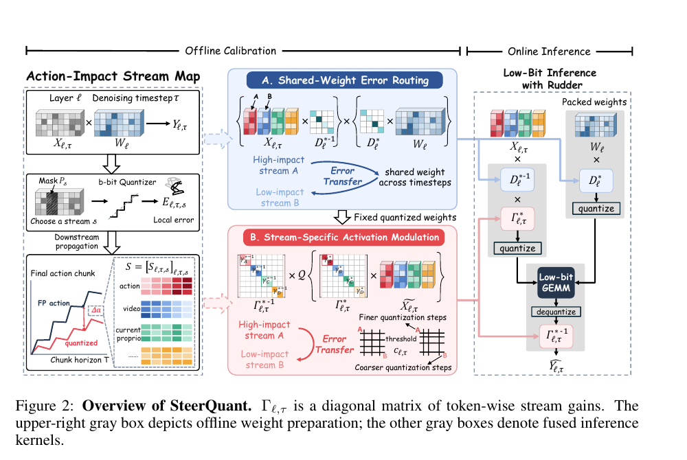
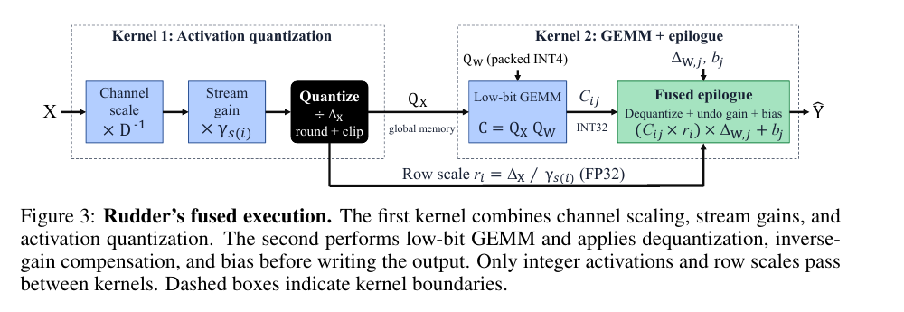
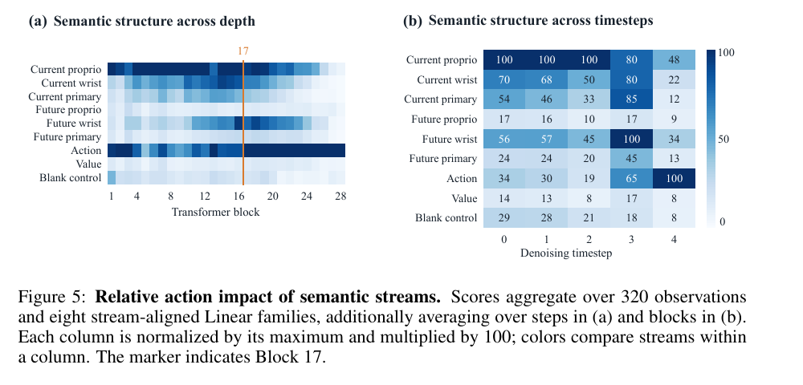

# 26. SteerQuant：详细易懂的阅读讲解

**SteerQuant: Steering Quantization Error with Action-Guided Scaling in World-Action Models**  
固定版本：**arXiv:2609.39056v1** · 2026-09-30 提交 · 15 页  
阅读包整理：2026-10-04 · 本讲解更新：2026-10-06 · 阅读状态：unread  
分类：WAM post-training quantization / action-guided scaling / shared weights / low-bit inference kernels

[本地固定版 PDF](paper-arxiv-v1.pdf) · [arXiv v1](https://arxiv.org/abs/2609.39056v1) · [官方 HTML 全文](https://arxiv.org/html/2609.39056v1) · [在线 v1 PDF](https://arxiv.org/pdf/2609.39056v1) · [WAM 目录](../README.md)

这份 README 按“先看问题与例子，再接公式，最后读证据”的顺序讲解。**先读第 1–4 节建立整体理解，再读第 5–9 节理解算法，最后读实验。** 第 5 节的 probe 推导可以第二遍再看。

下文页码为本地 PDF 的物理页码。论文结果均为作者报告；本阅读包没有运行模型、量化或 benchmark。教学例子会明确标注，不能当成实验数据。

## 1. 先用一句话理解这篇论文

**SteerQuant 在固定 bit-width 下，调整量化的缩放与裁剪参数，让对最终动作影响大的位置更准确；对影响较小的位置允许更多误差，同时让每个 Linear 始终只保存一份量化权重。**

可以把它理解成一笔“数值精度预算”的取舍：

- 原来：优先让各处的局部数字尽量接近 FP。
- 现在：先判断这些数字的误差会怎样传到最终 action，再决定量化参数偏向谁。

这里的“预算”只是帮助理解的比喻。论文没有证明总误差守恒，也没有把一个固定误差向量从 action 搬到 video。

它和你刚读过的 [Q-WAM](../013-q-wam/README.md) 的共同起点是：

> 局部 reconstruction error 小，不一定代表最终动作受影响小。

两篇的解决方式不同：

- **Q-WAM** 找 activation channel 空间里的敏感方向，让重要子空间走高精度低秩 branch。
- **SteerQuant** 给 layer–step–stream 区域打重要性分数，再调整量化网格；仍使用既定 W4A8/W4A4，没有给重要 stream 单独增加 bits。

先记住四个名字：

| 组成部分 | 用一句话解释 |
|---|---|
| Action-Impact Stream Map | 哪一层、哪一步、哪个 stream 的参考量化误差，最会影响最终 action？ |
| Shared-Weight Error Routing | 多个 streams 共用一份权重时，channel scaling 应优先照顾谁？ |
| Stream-Specific Activation Modulation | 不复制权重，怎样给不同 stream/step 不同的有效 activation 量化网格？ |
| Rudder | 怎样把这些额外 scaling 融入低精度 kernels，兑现速度收益？ |

## 2. 先讲清楚 stream、channel、layer 和 step

这几个词不区分，后面很容易读混。

假设一个 Linear 的计算为

\[
Y=XW,\qquad X\in\mathbb R^{N\times d},\quad W\in\mathbb R^{d\times d_{\mathrm{out}}}.
\]

\(X\) 的每一行是一个 token，每一列是一个 hidden feature，也就是一个 channel。

### 2.1 Stream 是一组“语义相同的 token 行”

例如某些 token 表示：

- 当前 primary-camera 图像；
- 当前 wrist-camera 图像；
- 当前 proprioception；
- 未来图像或未来 proprioception；
- action；
- value。

这些 token 可以被划分为不同 semantic streams。同一个共享 Linear 可以把所有这些行一起乘以同一份 \(W\)。

所以：

> **Stream 是 token 按语义分组；channel 是每个 token 内的特征维度。**

举个纯教学例子：如果 \(X\) 有 100 行、256 列，其中 60 行是图像 token、20 行是 action token、20 行是其他 token，那么可以有多个 streams，但它们都处在同一个 256-dimensional channel space 中。

它们不是必须分别对应一个 VisionDiT 或 ActionDiT。**Stream 不等于 expert，也不等于独立模型。** 论文关注的是多个语义区域经过共享 Linear 时的量化取舍；也不是要求整个 WAM 的所有模块共享一份参数。

### 2.2 Layer 与 step 是两条不同的轴

| 符号 | 含义 | 帮助理解的例子 |
|---|---|---|
| \(\ell\) | 某个具体 Linear layer | Block 24 内的 FFN projection |
| \(\tau\) | 一次 action chunk 生成中的 denoising step | 五步采样中的第 0–4 步 |
| \(s\) | semantic stream | 这一层输入/输出中的 action token 行 |
| channel | token 的 feature 维度 | hidden dimension 的第 37 列 |

“第 4 个 denoising step”不等于机器人执行到第 4 个环境时刻。它是**生成当前 action chunk 过程中，模型内部的一次去噪计算**。

同一个 Linear 的 \(W_\ell\) 会被不同 streams、不同 denoising steps 反复使用，这就是共享权重约束的来源。

**Figure 1 的模型背景要特别区分：该实验使用 Cosmos-Policy。** 它通过 latent frame injection 将 action、proprioception、value 等与图像 latent frames 放入同一个共享 DiT，联合处理这些 semantic streams；不能把之前阅读过的双 Transformer 结构套到这里。[Cosmos Policy Sec. 4.1](https://arxiv.org/html/2601.16163v1#S4.SS1)

Block 指 Transformer 沿 depth 堆叠的一个计算单元，通常包含 attention、FFN、normalization、residual connections 等；一个 block 内有多个 Linear。Figure 1 使用的模型有 28 blocks，Block 14/24 分别是第 14/24 个 block，不是两种任务或两个 streams。Block 索引从 1 开始，denoising-step 索引从 0 开始。

## 3. 为什么值得“改变误差放在哪里”？

### 3.1 一个最小例子：更大的局部误差，可以对应更小的动作误差

这是教学例子，不是论文数据。

假设最终动作只依赖两个中间量：

\[
a=10Y_A+Y_B.
\]

说明 \(Y_A\) 的变化会被放大 10 倍，\(Y_B\) 的变化只被放大 1 倍。

比较两组量化误差：

| 配置 | \(E_A\) | \(E_B\) | 局部误差平方和 | 最终动作变化 |
|---|---:|---:|---:|---:|
| 配置一 | 0.10 | 0.10 | 0.0200 | \(10(0.10)+0.10=1.10\) |
| 配置二 | 0.04 | 0.16 | 0.0272 | \(10(0.04)+0.16=0.56\) |

配置二的局部误差平方和更大，但动作变化几乎减半。

这就是本文想实现的取舍：

> 为了保护最终 action，可以接受低影响区域更大的局部误差。

真实模型不是这个简单线性函数，所以论文用 downstream derivative 估计每个区域对 action 的影响，再用实验检验这种取舍。

### 3.2 不能提前规定“action 永远重要，video 永远不重要”

直觉上容易认为：既然目标是控制，就始终保护 action stream。

但 video stream 的中间误差会经过 attention 和后续 layers 传到 action。较早层的图像表征被破坏，也可能严重影响最后的控制。

论文在 Sec. 3.2、Fig. 1 和 Appendix A 做了受控干预：

1. 先在 FP 计算中取得真实 W4A8 residual 的方向。
2. 把 residual 缩放到指定 normalized local error。
3. 只注入某个 Linear output 的某个 stream。
4. 后续保持 FP，观察最终 action RMSE 和闭环任务结果。

因此它比较的是：**在局部误差大小匹配的情况下，误差出现在不同位置会造成什么后果。**

| 干预位置 | Video stream 的 action RMSE | Action stream 的 action RMSE | 结论 |
|---|---:|---:|---|
| Block 14，最后一步 | 0.246 | 0.0833 | 此处 video error 对动作影响约大 2.9 倍 |
| Block 24，最后一步 | 0.0500 | 0.361 | 此处 action error 对动作影响约大 7.2 倍 |

对 Block 24 的 action stream，同等局部误差在第 0 步造成 RMSE 0.00330，在最后第 4 步造成 0.361，相差约 109.6 倍。

你应该从这里读出：

> **重要性同时依赖 layer、denoising step 和 stream，不能只按 token 类型固定排序。**

三个边界要一起记住：

- Block 14 的目标 local error 是 0.25，Block 24 是 0.50；只在各组比较内部匹配，不能跨 blocks 当成同样幅度。
- 这是单位置、重缩放 residual 的机制实验，不是全模型自然量化误差的直接测量。
- 闭环实验只有 3 个 LIBERO-10 tasks × 3 initial states，共 9 次 paired rollouts。FP 本身是 7/9，个别扰动配置达到 9/9，不代表扰动普遍改善策略。

### 补充：Figure 1(a)/(b) 具体扰动哪里？

干预点是所选 block 内的**一个 Linear output**，再用 stream mask 只选择其中 video 或 action 的 token 行；不是把整个 block 全部量化。

按语义分组后的 output 可以示意写为：

\[
Y=\begin{bmatrix}Y_{\mathrm{video}}\\Y_{\mathrm{action}}\\Y_{\mathrm{other}}\end{bmatrix}.
\]

Video 条件只替换 \(Y_{\mathrm{video}}\)，action 条件只替换 \(Y_{\mathrm{action}}\)。两者是独立实验，不是同时扰动。未选择的 rows 和后续计算保持 FP；最终 action 变化来自这个局部误差的下游传播。

- **Figure 1(a)**：固定最后 denoising step 4，在 Block 14 或 24 内分别扰动 video/action rows，比较最终动作。
- **Figure 1(b)**：固定 Block 24、action rows，分别在 Steps 0、1、2、3、4 注入误差。每种条件仅选择一个 step，并非同时扰动五步。
- 残差方向来自同一 FP input 上的 W4A8 output 减 FP output，再重缩放到目标 relative Frobenius error；不是任意 Gaussian noise。
- (b) 中 normalized local error 固定为 0.50，图中 0.00330 至 0.361 是**最终 action RMSE**，不是所注入 local error 的大小。
- 原文 Appendix A 称干预点为 selected Linear output，没有明确命名 Figure 1 具体选择的是 q/k/v/o 还是 FFN projection；不能自行补成某个特定子层。

位置：Fig. 1 与 Sec. 3.2，pp. 3–4；Appendix A、Table 5，pp. 12–13。

## 4. 先读 Figure 2：整套方法怎样连起来？

位置：Fig. 2，p. 4。

从左到右看：

### 左边：给每个区域打 action-impact 分数

把区域按 \((\ell,\tau,s)\) 划分。先算这个位置的参考量化 residual，再判断它经过后续网络和剩余采样步骤，会把最终 action 推动多少。

最后得到一个重要性表：某层、某步、某 stream 的分数是多少。

### 中间 A：选择大家共用的 channel scaling

用一个 diagonal matrix \(D_\ell\) 调整 activation 的列，同时反向调整 weight。不同 streams/steps 共用它。

这一步决定**共享权重条件下的整体折衷**。

### 中间 B：不同 streams 再加不同 scalar gain

在共同的 channel scaling 之后，再按 stream/step 乘 \(\gamma_{\ell,\tau,s}\)，量化后把 gain 补偿回去。

这一步让不同 stream 使用不同的有效 activation 网格，但不生成不同的权重副本。

图里的“fine/coarse”表达的是有效舍入间隔；变细同时会缩窄 clipping range，后面会用数字说明。

### 右边：部署时只留一份 packed weight

\(D_\ell\) 折进 \(W_\ell\)，权重离线量化保存。推理时对 activation 做 scaling、quantization，执行 low-bit GEMM，再在输出端补偿。

图中的 Error Transfer 应理解为**不同区域的误差取舍发生改变**，不是实际搬运或守恒某个误差向量。

## 5. 第一部分：Action-Impact Stream Map 到底测什么？

### 5.1 先看局部误差

FP 的 Linear output 为 \(Y_{\ell,\tau,s}\)，目标 bit-width 下的参考量化 output 为 \(\widehat Y_{\ell,\tau,s}\)：

\[
E_{\ell,\tau,s}=\widehat Y_{\ell,\tau,s}-Y_{\ell,\tau,s}.
\]

这里使用 FP-captured input 构造局部 residual，避免一开始把上游量化误差混进该位置。

仅看 \(\|E\|\)，只能知道数字差了多少；还不知道这些差异会怎样影响最终动作。

### 5.2 再看 downstream derivative

把最终 action chunk 的各维变化，用 training-set 的固定每维 standard deviation 标准化：

\[
\Delta a_d^{\mathrm{std}}
=\frac{\Delta a_d}{\sigma_d+10^{-6}}.
\]

这样可以减少不同 action dimensions 数值尺度不同带来的偏置。以下 \(a\) 表示这个 standardized final action vector，共 \(m\) 个数。

定义

\[
J_{\ell,\tau,s}
=\frac{\partial a}
{\partial\operatorname{vec}(Y_{\ell,\tau,s})}.
\]

这里的 \(J\) 是从**指定 Linear output**到最终 action 的 Jacobian。它覆盖当前 sampler 后续计算及剩余 denoising steps，不是到机器人环境未来状态的 derivative。

一阶近似给出：

\[
\Delta a\approx J_{\ell,\tau,s}\operatorname{vec}(E_{\ell,\tau,s}).
\]

因此，这个位置的重要性定义为：

\[
S_{\ell,\tau,s}
=
\left[
\frac1m
\mathbb E_{\mathcal D}
\left\|
J_{\ell,\tau,s}\operatorname{vec}(E_{\ell,\tau,s})
\right\|_2^2
\right]^{1/2}.
\]

逐项翻译：

- \(E\)：这次参考量化实际产生什么方向、什么大小的误差？
- \(J\)：这个误差方向经过下游，会怎样改变最终 action？
- \(JE\)：预计导致的 action displacement。
- 平方、对 calibration observations 平均、除以动作维数、开根号：得到一个 RMS 分数。

所以 \(S\) 大，表示**这个参考量化 residual 预计更伤害动作保真度**。

它不是纯粹的 sensitivity，也不是单独的 \(\|J\|\)：**误差幅度、误差方向、下游敏感性都进入了分数。** 目标 bit-width 变了，参考 residual 也会变，因此不是与精度无关的永久重要性表。

### 5.3 为什么不用完整 Jacobian？

一个区域可能有很多 token/channel，最终 action chunk 也有很多维。显式存储所有 Jacobians 会很贵。

作者使用 Rademacher probes：

\[
z_p\in\{-1,+1\}^m,\qquad
\mathbb E[z_pz_p^\top]=I.
\]

计算 scalar \(z_p^\top a\)，反向传播一次，就能得到多个 Linear outputs 上的

\[
g_{\ell,\tau,s,p}=J_{\ell,\tau,s}^\top z_p.
\]

再和已保存的 residual 做内积：

\[
g^\top\operatorname{vec}(E)
=z_p^\top J\operatorname{vec}(E).
\]

为什么有用？因为对任意 vector \(v\)：

\[
\mathbb E_z(z^\top v)^2
=v^\top \mathbb E[zz^\top]v
=\|v\|_2^2.
\]

所以可以估计单个 observation 上的 squared score：

\[
\widehat e_{\ell,\tau,s}
=
\frac1{Pm}\sum_{p=1}^{P}
\left[
g_{\ell,\tau,s,p}^\top\operatorname{vec}(E_{\ell,\tau,s})
\right]^2.
\]

然后平均 observations、开平方，得到 \(\widehat S\)。

**关键是一次 projected reverse pass 可同时服务许多区域。** 不用为每个 stream、每层、每步单独重跑完整 downstream 才能计算分数。

技术上，squared score estimator 无偏；开平方后的 \(\widehat S\) 本身一般不无偏。第一遍记住“随机投影估计误差会把动作推多远”就够了。

### 5.4 论文这里的预算有多大？

Cosmos-Policy W4A8 map 分析使用：

- 320 observations、16 probes；
- 5 个 denoising steps；
- \(16\times7\) 的 action chunk，即 \(m=112\)；
- 28 blocks；
- 8 类 Linear families × 9 个 temporal streams；
- cross-attention 的 k/v 各有一个 global-text region。

合计：

\[
28\times5\times(8\times9+2)=10{,}360\text{ regions}.
\]

Projected reverse passes 为：

\[
320\times16=5{,}120.
\]

这解释了它怎样避免“区域数 × 完整反向”的成本。但 residual construction 和各区域 contractions 仍需要工作；**5,120 不是完整 calibration 的 GPU-hours，也不能默认其他模型都使用同样预算。**

位置：Sec. 4.1，pp. 4–5；Appendix B，pp. 12–14。

## 6. 第二部分：Shared-Weight Error Routing

### 6.1 先理解一个不改变 FP 结果的变换

选择 positive diagonal matrix：

\[
D_\ell=\operatorname{diag}(d_1,\ldots,d_d),\quad d_j>0.
\]

把计算改成：

\[
XW=(XD_\ell^{-1})(D_\ell W).
\]

左边 activation 的某个 channel 除以 \(d_j\)，右边 weight 对应一行乘 \(d_j\)，FP 下两次 scaling 抵消。

教学例子：

\[
X=(8,1),\quad
W=\begin{pmatrix}0.1\\1\end{pmatrix},\quad
XW=1.8.
\]

取 \(D=\operatorname{diag}(8,1)\)，则

\[
XD^{-1}=(1,1),\qquad
DW=\begin{pmatrix}0.8\\1\end{pmatrix}.
\]

相乘仍为 1.8。但 activation 从范围差很大的 \((8,1)\) 变成 \((1,1)\)，quantizer 看到的分布变了。

加入量化：

\[
\widehat Y_{\ell,\tau,s}(D_\ell)
=
\mathcal Q(X_{\ell,\tau,s}D_\ell^{-1})
\mathcal Q(D_\ell W_\ell).
\]

量化有 rounding/clipping，因此不同 \(D\) 不再等价。

\(D\) 既改变 activation 的量化条件，也改变 weight 的量化条件。它能缓解某些 activation outliers，也可能让 weight 更难量化，需要找折衷。

### 6.2 为什么一个 stream 不能随便用一个独立的 \(D\)？

若 stream A 用 \(D_A\)，stream B 用 \(D_B\)，对应权重分别为：

\[
D_AW,\qquad D_BW.
\]

量化后通常是两份不同 packed weights。如果再随 denoising step 改变，就需要更多份。

本文要求的是：

> **每个 Linear 只有一个 \(D_\ell\)，并保存一份由它生成的量化权重，供全部 streams/steps 使用。**

因此 \(D_\ell\) 必须在所有区域之间做取舍。

### 6.3 怎样让取舍偏向重要区域？

普通局部 reconstruction 更关心所有数字总体差多少。SteerQuant 用 map 给不同区域的 loss 加权：

\[
D_\ell^*
=
\arg\min_{D_\ell}
\sum_{\tau,s}
\frac{\pi_\tau\omega^D_{\ell,\tau,s}}{n_s}
\mathbb E_{\mathcal D}
\left\|
\widehat Y_{\ell,\tau,s}(D_\ell)-Y_{\ell,\tau,s}
\right\|_F^2.
\]

这里：

| 项 | 作用 |
|---|---|
| \(\omega^D_{\ell,\tau,s}\) | 从 action-impact map 得到的重要性权重 |
| \(n_s\) | stream token 数量；防止图像 token 多就自动主导 loss |
| \(\pi_\tau\) | calibration 中的 denoising-step frequency 权重 |
| reconstruction term | 当前 \(D\) 对这个区域造成多大局部误差 |

高-impact 区域出错会付出更大 loss，优化器就更倾向选择照顾它的 shared scale。

这叫 error routing，但它**不要求每个低-impact stream 的误差必须增加**；只是允许为了整体动作保真度做这种取舍。

优化完，把 \(D_\ell^*\) 折入 weight：

\[
\widehat W_\ell=\mathcal Q(D_\ell^*W_\ell).
\]

部署始终使用这一份。

还要注意：这是 **action-impact 加权的局部 reconstruction optimization**。它没有在每次尝试 \(D\) 后，都运行完整 sampler 直接最小化最终 action error。

位置：Sec. 4.2，p. 5。

### 6.4 与 SmoothQuant 的关系：相同变换，不同 scaling 选择

\[
XW=(XD^{-1})(DW)
\]

**这个等价 channel scaling 和 SmoothQuant 是相同的数学操作，不是 SteerQuant 新发明的。**

原始 SmoothQuant 使用 activation/weight 的 channel magnitude statistics 选择 smoothing factors：

\[
d_j=\frac{A_j^\alpha}{B_j^{1-\alpha}},
\qquad
A_j=\max |X_{:,j}|,\quad
B_j=\max |W_{j,:}|.
\]

\(\alpha\) 控制把多少 quantization difficulty 从 activations 转给 weights；\(\alpha=0.5\) 时，对应 channel 的变换后最大幅度均为 \(\sqrt{A_jB_j}\)。原论文也会通过 calibration 上的 grid search 选择合适的 \(\alpha\)，不能说 SmoothQuant 不考虑量化后的模型效果。[SmoothQuant Sec. 4 与 Eq. (4)](https://proceedings.mlr.press/v202/xiao23c/xiao23c.pdf)

SteerQuant 的区别是按 Action-Impact Map 优化 shared \(D\)：不同 layer–step–stream 的 reconstruction error 用不同重要性 weights 加权，并做 stream-token normalization。在共享权重的折衷中，优先照顾对最终动作影响大的区域。变换后的 activation/weight ranges 不必严格相等。

然后它还增加 stream/step-specific gains、clipping calibration 和 Rudder fusion。可以记成：

> SmoothQuant 提供等价 scaling 的基本工具；SteerQuant 用 action-impact 指导这个工具的取舍，并补上 WAM stream/step 与部署设计。

## 7. 第三部分：Stream-Specific Activation Modulation

共同的 \(D\) 只能给一个 shared compromise。但 streams 在不同 denoising steps 的范围、重要性仍不同，能否再微调？

作者给每个 layer–step–stream 一个 positive scalar gain \(\gamma_{\ell,\tau,s}\)。

### 7.1 为什么 scalar gain 可以不复制 weight？

固定量化权重 \(\widehat W\)，先定义：

\[
\widetilde X_s=X_s(D^*)^{-1}.
\]

计算改成：

\[
\widehat Y_s
=
\gamma_s^{-1}
\mathcal Q(\gamma_s\widetilde X_s;c)
\widehat W.
\]

即：

1. 量化 activation 前，整组 stream 乘 \(\gamma_s\)；
2. 使用同一份 \(\widehat W\) 做 GEMM；
3. 输出除以 \(\gamma_s\)。

如果 activation 不量化，这个 scalar 可以从 matrix multiplication 中提出并抵消：

\[
\gamma_s^{-1}(\gamma_s\widetilde X_s)\widehat W
=\widetilde X_s\widehat W.
\]

所以它不用像独立 channel matrix 那样折成多份 weights。

注意两种 scaling 的区别：

| 参数 | 沿哪个维度作用 | 对谁共享 | 部署位置 |
|---|---|---|---|
| \(D_\ell\) | feature/channel 列；不同列可不同 | 一个 Linear 的全部 streams/steps | 一部分折入 weight，一部分作用在 activation |
| \(\gamma_{\ell,\tau,s}\) | 同一 stream 的 token 行；每个 stream 一个 scalar | 同一 layer/step/stream 的 tokens | activation 前放大，output 端补偿 |

### 7.2 Gain 如何改变有效量化网格？

对于 symmetric signed quantizer，令

\[
q_{\max}=2^{k-1}-1,\qquad
\Delta=\frac{c}{q_{\max}},
\]

\[
\mathcal Q_k(x;c)
=\Delta\,
\operatorname{clip}
\left(
\operatorname{round}(x/\Delta),
-q_{\max},q_{\max}
\right).
\]

这里 \(\mathcal Q\) 在数学公式中包含 quantize 与 dequantize。

对 \(\gamma x\) 量化、再除以 \(\gamma\)，等效为：

\[
\text{effective step}
=\frac{c}{q_{\max}\gamma},
\qquad
\text{effective clipping range}
=\left[-\frac c\gamma,\frac c\gamma\right].
\]

**增大 \(\gamma\)：网格更密，范围更窄。  
减小 \(\gamma\)：网格更疏，范围更宽。**

所以 gain 调的是 rounding 与 clipping 之间的取舍，不是免费增加 bits。

### 7.3 用 INT4 数字彻底看懂

教学例子：INT4，\(q_{\max}=7\)，共同 threshold \(c=7\)。

| Gain \(\gamma\) | 还原后可表示范围 | 还原后的网格间距 |
|---:|---|---:|
| 0.5 | \([-14,14]\) | 2 |
| 1 | \([-7,7]\) | 1 |
| 2 | \([-3.5,3.5]\) | 0.5 |

对于小值 \(x=1.4\)：

- \(\gamma=1\)：还原后约为 1，误差 0.4。
- \(\gamma=2\)：还原后约为 1.5，误差 0.1。

看起来保护了它。

但对于 \(x=5\)：

- \(\gamma=1\)：可以表示为 5，误差 0。
- \(\gamma=2\)：先放大到 10，超过 threshold 7，clip 后还原为 3.5，误差 1.5。

所以不能把论文读成：

> 分数越高，就无条件把 gain 拉大。

作者优化 \(c\) 和各 stream gains，结合实际分布处理这个取舍。

### 7.4 这一阶段优化什么？

固定前一阶段的 \(\widehat W\)，target 是：

\[
\widetilde X_s\widehat W.
\]

也就是**activation 保持未量化、weight 已量化**的输出。这样这阶段专门处理 activation quantization 引入的误差；不要把它和前一阶段对原 FP \(Y\) 的 reconstruction target 混在一起。

它仍使用 map-derived weighted reconstruction，并有约束：

\[
c_{\min}\le c\le c_{\max},
\qquad
\gamma_{\min}\le\gamma_s\le\gamma_{\max},
\]

\[
\sum_s n_s\log\gamma_s=0.
\]

最后一项等价于 token-weighted geometric mean 为 1，用来固定整体 scaling 的自由度。例如把所有 \(\gamma\) 和 \(c\) 同时乘同一个正数，会得到相同的有效网格，参数存在冗余；这个约束消除这种退化。

它不是“总误差守恒”的约束。

Appendix C 把 scores 转成 positive importance weights：

\[
u_{\ell,\tau,s}
=
(\widehat S_{\ell,\tau,s}^2+\eta)^\rho,
\qquad
\eta>0,\quad 0<\rho\le1.
\]

\(\eta\) 避免小分数区域权重变成零；\(\rho\) 压缩过大的分数差距。Shared-weight 与 activation calibration 分别在其对应范围内归一化。

所有 \(D,\gamma,c\) 都在 offline calibration 中确定。推理时按 layer/step/stream 查参数，**不是每收到一个 observation 就在线反向传播重新优化**。

位置：Sec. 4.3，pp. 5–6；Appendix C，pp. 14–15。

## 8. 第四部分：Rudder 为什么是方法的重要组成？

**先解释 GEMM：General Matrix Multiplication，通用矩阵乘法。** BLAS 的一般形式为

\[
C\leftarrow \alpha\,\operatorname{op}(A)\operatorname{op}(B)+\beta C,
\]

其中 \(\operatorname{op}\) 允许原矩阵或转置。本文阅读时主要把它理解成 Linear 的核心 \(XW\) 即可，bias 等可以在后处理/epilogue 中加入。[BLAS DGEMM 定义](https://www.netlib.org/blas/dgemm.f)

例如 \(X\) 是 \(100\times256\)，\(W\) 是 \(256\times512\)，矩阵乘法输出 \(100\times512\)。FP GEMM 使用浮点 operands；本文 low-bit GEMM 使用量化后的 integer activations/weights，INT32 accumulate，再按 scales 还原为 BF16/FP16 output。W4A4 不意味着 accumulator 或 output 也是 4 bits。

GEMM kernel 是 GPU 执行矩阵乘法的程序；Rudder 则把它与本方法需要的 scaling、quantization、output compensation 配合起来。

数学上多做几个 scaling 很简单，实际 GPU 上如果每一步都单独启动 kernel，会有额外 launch 和 memory traffic。

可能出现：低比特 GEMM 更快，但外围操作把时间又花掉了。

Rudder 把执行拆成两个 fused kernels：

位置：Fig. 3，p. 6。

### Kernel 1：一次完成 activation 的变换与量化

对于 token 行 \(i\)，它所属 stream 记为 \(s(i)\)：

\[
Q_{X,i}
=
\operatorname{clip}
\left[
\operatorname{round}
\left(
\frac{\gamma_{s(i)}X_i(D^*)^{-1}}{\Delta_X}
\right)
\right].
\]

同时保存 row scale：

\[
r_i=\frac{\Delta_X}{\gamma_{s(i)}}.
\]

它融合：

- channel scaling \(D^{-1}\)；
- stream gain \(\gamma\)；
- activation quantization。

输出 integer activations 和少量 FP32 row scales；不额外保存整个已经缩放的 FP activation。

### Kernel 2：low-bit GEMM，加融合 output epilogue

Packed INT4 weights 为 \(Q_W\)，integer accumulation：

\[
C_{ij}=\sum_k Q_{X,ik}Q_{W,kj},
\qquad C\text{ 用 INT32 accumulate}.
\]

输出为：

\[
\widehat Y_{ij}
=
\operatorname{cast}_{\mathrm{BF16/FP16}}
\left[
(C_{ij}r_i)\Delta_{W,j}+b_j
\right].
\]

其中：

- \(r_i\) 同时处理 activation dequantization 与 inverse gain；
- \(\Delta_{W,j}\) 是 per-output-channel weight scale；
- bias 在补偿后加入；
- output cast 在 epilogue 里完成。

INT32 GEMM result 不需要单独写回 global memory 再启动另一个处理 kernel。

**一份权重、多个 streams 的 row scales、一个低比特 GEMM**，就是这个部署设计的核心。

这也说明：只根据论文公式写出几个独立 scaling 操作，并不能自动复现其 latency。算法与 fused execution 必须一起看。

## 9. 把整个 PTQ 流程串起来

### Offline calibration

1. 固定预训练 FP WAM、目标 bit-width、calibration observations 与采样设置。
2. 捕获 Linear inputs/outputs，构造参考 quantization residuals。
3. 从 standardized final action 反向，建立 layer–step–stream impact map。
4. 用该 map 的 weights 优化每层共享 \(D_\ell\)。
5. 将 \(D_\ell\) 折入 \(W_\ell\)，量化并固定一份 packed weight。
6. 在固定权重下，优化每 layer/step 的 \(c\) 及各 streams 的 gains。
7. 保存 packed weights、scales、stream row 信息及 layer/step lookup parameters。

### Deployment

每个 denoising step：

1. 查当前 layer/step 对应的 \(D^{-1},c,\gamma\)。
2. Rudder 量化 activations。
3. 使用同一份 packed weight 执行低比特 GEMM。
4. 在 epilogue 还原 scale、补偿 gain、加 bias。
5. 继续 sampler，直到输出 action chunk。

它是 **PTQ**。构造 map 时需要 backward；这不意味着重新训练预训练 WAM，也不意味着出现 QAT。优化的是量化相关 scaling/clipping 参数。

论文没有靠减少 denoising steps、缩短 action chunk 或省略 future imagination 来实现这部分加速。因此要把量化收益与其他结构/采样加速分开。

## 10. Figure 5：重要性怎样随 depth 和 step 变化？

位置：Fig. 5，p. 14。

这张图能把前面的单位置干预推广成一张更广的观察图。

### 左图：横轴是 Transformer blocks

纵轴是不同 streams。论文这组 Cosmos-Policy W4A8 数据中，较前面的 blocks 有不同 current-state streams 比较重要；从约 Block 17 起，action stream 变得突出。

它支持“重要性随 depth 改变”，不支持把这个分界点当成所有 WAM 的通用常数。

### 右图：横轴是五个 denoising steps

看最后一步：

- Action 为 100；
- Current proprioception 为 48；
- Future wrist-camera 为 34；
- Current primary-camera 为 12。

到第 3 步，则 Future wrist-camera 为 100、Current primary-camera 为 85、Action 为 65。

说明**哪个 stream 最重要，会随 denoising step 改变**。

### 最容易看错的归一化

**每一列都单独除以这一列的最大值，并乘 100。**

所以：

- 100 表示“该列里最大”，不是占总影响的 100%；
- 能比较同一列里不同 streams 的相对重要性；
- 不能因为 step 0 和 step 4 的某个格子都是 100，就说两步绝对 impact 相同；
- 不能跨列颜色直接推出绝对误差随时间的变化。

左图是对 observations、Linear families 和 steps 聚合；右图对 observations、Linear families 和 blocks 聚合。聚合 score 是单区域 squared impacts 的 RMS 汇总，不是把整组 streams 同时扰动后测得的整体 action damage。

## 11. 读主结果：哪些任务上接近 FP？

### 11.1 先弄清量化范围

主要量化的是：

- self/cross-attention 的 q/k/v/output projections；
- FFN up/down projections。

Norm、RoPE、Softmax、GELU、KV cache、residual additions 保持 BF16。

所以 W4A4 表示**指定 Linear 范围的 weight/activation precision**，不是整个机器人 policy 每个数都用 4 bits。

Weights 用 symmetric per-output-channel W4。Activations 有 layer/step 的 base scale，再通过 stream gains 得到不同的有效 scale。

### 11.2 Calibration 与任务设置

| Model | Benchmark | Calibration observations | 评估规模 |
|---|---|---:|---|
| Cosmos-Policy | LIBERO，40 tasks | 320 个 LIBERO training observations | 3,000 rollouts |
| FastWAMJoint | LIBERO 四 suites | 100 个 LIBERO training observations | 2,000 rollouts |
| Cosmos-Edge | RoboLab | 512 个 DROID training observations | 1,200 rollouts |

同一模型内各方法匹配 checkpoint、inference settings、calibration set、initial states 与 seeds；calibration 与 evaluation 数据无重叠。

**FastWAMJoint 保留 joint future-state/action denoising。** 它与 Fast-WAM 测试时省略 future imagination 的模式不同，因此不能把你刚读过的另一篇 Fast-WAM 配置直接当成同一实验对象。

### 11.3 Table 1 的闭环表现

| Model | FP | SteerQuant W4A8 | SteerQuant W4A4 |
|---|---:|---:|---:|
| Cosmos-Policy / LIBERO | 98.5% | 98.6% | 98.3% |
| FastWAMJoint / LIBERO | 98.9% | 98.1% | 98.4% |
| Cosmos-Edge / RoboLab | 21.83% | 14.67% | 17.33% |

位置：Table 1，p. 7。

应当这样读：

- LIBERO 两个模型的平均 success 与 FP 相差不超过 0.8 percentage points。
- RoboLab 的 W4A8 与 W4A4 分别下降 7.16、4.50 percentage points，仍有明显损失。
- FastWAMJoint W4A4 的 QuaRot 为 98.7%，高于 SteerQuant 的 98.4%；SteerQuant 不是所有 case 都第一。
- RoboLab 中 W4A4 反而高于 W4A8，这是报告配置的结果，不能据此推导“activation bits 越低控制越好”。

因此，本文有较强的 LIBERO 恢复证据，但不能概括为所有 WAM 任务都无损。

## 12. 速度和显存：2.23× 到底测了哪一段？

Table 2 在 **RTX 4090** 上测 DiT denoising replay：

- 输入为 FP-captured inputs；
- 使用 CUDA Graphs、CUDA events；
- warm-up 后计时，报告 median；
- Cosmos-Policy 为 5 个 warm-up sequences 与 20 个 timed sequences。

这测的是 denoising computation，不等于从相机输入到机器人动作完成的全流程。

| Model | BF16 latency | W4A8 latency / speedup | W4A4 latency / speedup |
|---|---:|---:|---:|
| Cosmos-Policy | 261.460 ms | 133.455 ms / 1.959× | 117.322 ms / 2.229× |
| FastWAMJoint | 360.450 ms | 260.977 ms / 1.381× | 193.916 ms / 1.859× |
| Cosmos-Edge | 881.637 ms | 563.858 ms / 1.564× | 521.589 ms / 1.690× |

| Model | BF16 → W4A4 peak allocated GPU memory |
|---|---|
| Cosmos-Policy | 4.241 → 1.645 GB |
| FastWAMJoint | 12.116 → 3.370 GB |
| Cosmos-Edge | 8.492 → 6.398 GB |

Peak memory 包括 resident weights、activations 与 temporary buffers；packed weight storage 只算保存的 weights，且该表使用 GiB，不能把两列当成同一个指标。

Packed weight storage 分别从 3.644 → 1.194 GiB、11.230 → 2.983 GiB、6.276 → 4.314 GiB。

相对 W4A4 QuaRot，SteerQuant 额外降低 latency 4.3%、12.5%、8.5%。

读 headline 时要保留两个限制：

1. **2.23× 是量化算法与低精度执行相对 BF16 的联合收益**，不是仅加 action-impact weighting 就快 2.23×。
2. RTX 4090 的 kernel 收益不能直接沿用成 A100、H100 或其他 GPU 的数字。

PTQ4DiT、Q-DiT 因所测配置没有官方 low-bit kernels，未列入效率表。位置：Table 2，p. 8；Appendix D，p. 15。

## 13. 消融：真正带来动作恢复的是哪一部分？

Table 3 在 Cosmos-Policy 上用 1,800 observations，来自 40 tasks 的 600 trajectories，报告 W4A8/W4A4 平均 standardized action RMSE：

| Variant | Action RMSE |
|---|---:|
| Base quantizer | 0.1581 |
| Shared-weight routing only | 0.1224 |
| Activation modulation only | 0.1529 |
| 两者都有，但使用 uniform weights | 0.1416 |
| 完整 SteerQuant | 0.1189 |

位置：Table 3，p. 8。

三个重要读法：

### 13.1 共享权重 scaling 贡献了大部分恢复

Base 从 0.1581 降到 routing-only 的 0.1224，已经改善很多。

完整方法进一步降到 0.1189。因此两部分都有帮助，但不能说 gains 与 shared scaling 各自贡献一半。

### 13.2 不是“只要加更多 scaling 就一定更好”

两个模块都保留、但不使用 action-impact 权重时，RMSE 是 0.1416，明显高于完整配置。

这支持：**选择量化参数时，照顾哪些区域很重要。**

### 13.3 “误差被重新取舍”有直接观察证据

Fig. 4 在 1,120 个 layer–step–Linear-family units 中，与 uniform weighting 比较，有 935 个，即 **83.48%**，同时满足：

- high-impact stream group 的局部误差降低；
- low-impact stream group 的局部误差增加。

这和本文“steering”的意图一致。

83.48% 是满足这种误差变化方向的 units 比例，不是任务成功率，也不是“减少了 83.48% 的 action error”。

局部误差分析使用 FP inputs，不能单凭它断言所有被牺牲区域在量化闭环中都无害。

### 13.4 统计与稳定性读数

完整配置相对 Base 的 RMSE 降低 24.79%。Table 3 的 95% CIs 针对 paired difference：

\[
\mathrm{RMSE}_{\mathrm{SteerQuant}}
-\mathrm{RMSE}_{\mathrm{variant}}.
\]

例如相对 routing-only 的 CI 为 \([-0.0044,-0.0026]\)。它按 task–seed stratum 内整条 trajectories bootstrap，是未做多重比较调整的 CI；不是每个 variant 自身的 CI，也不是 success-rate CI。

Map stability 在同一 320-observation pool 中做 200 次 disjoint 160/160 splits，median Spearman 0.967、top-10% overlap 0.979，支持该分布内重要性排序稳定。它没有验证跨新任务、不同 embodiment 或量化闭环状态分布的排序泛化。

## 14. 真实机器人：有收益，但指标要准确读

作者在 AgileX Cobot Magic 双臂平台上评估 fine-tuned FastWAMJoint：

- 三个任务；
- 每个任务每个配置 12 trials；
- RTX 4090 24 GB；
- BF16 与 SteerQuant W4A8 使用相同 checkpoint、matched initial conditions。

| 配置 | Battery Insertion | Pack Objects | Stack Cups | 平均 task score | Request-to-action latency |
|---|---:|---:|---:|---:|---:|
| BF16 | 83.33% | 69.44% | 75.00% | 75.93% | 462.79 ms |
| SteerQuant W4A8 | 75.00% | 88.89% | 83.33% | 82.41% | 341.97 ms |

位置：Table 4、Sec. 5.5，p. 9；Appendix D，p. 15。

这里“平均”实际是 task score：

- Battery Insertion 与 Stack Cups 用 binary success。
- Pack Objects 完成 \(k\) 个物体得 \(k/3\) 分，共三个物体。
- 最后对三个任务等权平均。

所以 82.41% 不能解读为“所有 trials 里 82.41% 完整成功”。

平均 score 更高，但 Battery Insertion 下降；样本数也有限，不能断言所有任务都改善或与 FP statistical equivalence。

Latency 为发送 policy request 到收到 predicted actions，462.79 → 341.97 ms，约 **1.35×**。它包含的范围比 DiT replay 更宽，但不包含 robot motion execution。

真实机器人只测 W4A8，不能把这部分结论延伸到 W4A4。

## 15. 读懂这篇后，还应保留哪些不确定性？

### 15.1 Map 是局部的一阶诊断

它测某个区域的参考 residual 在 FP downstream 中怎样影响 action。真正全模型量化会让多个区域同时变化，出现 cross-region interactions、高阶响应及闭环状态迁移。

这些不会因为有一个 \(S\) 表就自动消失。

### 15.2 Map 固定，优化后的 residual 会变化

\(S\) 使用初始参考 residual 的方向和幅度。调整 \(D,\gamma,c\) 后，residual 本身改变，但 map 不随每次优化完整重算。

因此 map 是有依据的 calibration guidance，不是优化后最终 action damage 的精确实时测量。

### 15.3 Action fidelity 不是 reward 最优性

目标是接近 FP teacher 的动作。FP teacher 自己可能失败，所以“动作更像 FP”与“任务更容易成功”相关，但不等价。

这也是论文需要同时报告 action RMSE 与 closed-loop tasks 的原因。

### 15.4 论文还没有给出完整复现配置

v1 给出目标与约束，但没有完整列出所有 \(\eta,\rho,c_{\min/\max},\gamma_{\min/\max}\) 的数值、优化器配置及总 calibration GPU-hours。

不要自行把某个 Adam/STE 方案写成作者方法。仅有 packed weights 也不够部署，还需要 gains、scales、stream identities 与 step lookup。

本次以固定论文为讲解来源，没有刷新官方代码发布状态。

## 16. 最后用一条计算链复述整篇

**先测影响：**

\[
\text{参考量化误差 }E
\xrightarrow{\text{downstream }J}
\text{预计动作变化 }JE
\longrightarrow
\text{重要性 weights}.
\]

**再改网格：**

\[
\text{一份共享 channel scaling }D
+
\text{stream/step scalar gains }\gamma
+
\text{clipping }c
\longrightarrow
\text{优先保护高-impact 区域}.
\]

**最后兑现部署：**

\[
\text{一份 packed weight}
+
\text{融合 activation quantization / GEMM epilogue}
\longrightarrow
\text{low-bit inference}.
\]

读公式时反复问三件事就能保持清楚：

1. 这个参数是在 token 行、feature 列，还是 sampling step 上变化？
2. 它是否会要求不同 packed weight copies？
3. 它优化的是局部 reconstruction、final-action fidelity，还是实际 closed-loop performance？

能准确回答这三件事，就能理解 SteerQuant 的结构约束、数学近似和实验边界。

---

## 与本 FYP 的关系

这篇给出一个清晰的研究路径：先以同等 local error 的干预证明 impact 差异，再按真实模型结构制定可执行的误差取舍，最后同时测 action fidelity、closed-loop performance 和 latency。它特别提醒：video stream 不一定始终低影响；误差对动作的重要性可以随层与 denoising step 反转。

本文 FastWAMJoint 保留 joint future-state/action denoising；它与 Fast-WAM 在测试时省略 future imagination 的模式不同。应对照 [Fast-WAM 本地包](../004-fast-wam/README.md) 中 inference modes，再判断目标模型有没有相同的 semantic streams、共享 Linear weights 与 timestep 结构。

LeWM 的 action-conditioned latent predictor 加 MPC/CEM 又是另一种计算链。将本文的 final-action score 换成 rollout cost sensitivity，只能建立 cost perturbation 诊断；elite membership、candidate cost gaps、CEM updates、首动作保真、closed-loop success 与 end-to-end planner latency 仍需分别证明。本包提供阅读启发，没有启动新的实验或修改已冻结的判据。

## 分时阅读路线

| 时间 | 阅读顺序 | 应完成的记录 |
|---|---|---|
| 20 分钟 | Abstract；Fig. 1 p. 3；Fig. 2 p. 4；Tables 1–2 pp. 7–8 | 写出 gap；指出 shared weights 的限制；区分 LIBERO 与 RoboLab 退化、denoising 与 end-to-end inference |
| 90 分钟 | Sec. 3–4 pp. 3–6；Eqs. (5)–(10)；Appendix C pp. 14–15 | 推出 map score；解释 \(D\)、\(\gamma\)、\(c\) 各自作用；推导 effective clipping range 和 step size；说明 Rudder 如何补偿 |
| 180 分钟 | Appendices A–D pp. 12–15；Table 3 与 Fig. 4 pp. 8–9；再对读 Q-WAM Sec. 4 | 检查 probe estimator、map stability、校准与计时条件；列出未给出的配置；填写 Meeting Card |

建议对读顺序：SteerQuant Fig. 1 的 matched-error intervention → Q-WAM Fig. 3 的 local-error 与 AOG 对照 → 两篇 sensitivity 定义 → 两篇干预方式与执行成本。先比较它们如何识别问题，再比较它们为什么选择不同的解法。

## Reading Questions

以下问题留给阅读后自己回答。

1. Eq. (3) 的 normalized local error 与 Eq. (5) 的 standardized action score 分别归一化什么？
2. Appendix A 的干预为什么保留自然 residual 方向但重缩放幅度？它能隔离哪些因素，不能代表哪些部署误差？
3. 为什么 Block 14 与 Block 24 的 stream 重要性会反转？Fig. 5 提供了怎样的更广泛观察？
4. Action-Impact Stream Map 为什么取 \(JE\)，而不只取 \(\|J\|\) 或 local error？
5. Rademacher projections 为什么可无偏估计 squared score？取平方根后为何一般不无偏？
6. \(O(|\mathcal D|P)\) 省掉哪些工作，哪些工作仍随 region 数量增长？
7. Map 在 calibration 中固定后，怎样判断初始 residual 的重要性排序对优化后 residual 仍适用？
8. 为什么独立为每个 stream 选 channel scaling 会与 shared weights 冲突？
9. Shared-weight loss 中 \(1/n_s\)、\(\pi_\tau\)、\(\omega^D\) 分别解决什么问题？
10. Eq. (9) 为什么以未量化 activation 乘固定 quantized weights 为 target？
11. 增大 \(\gamma_s\) 如何同时改变 rounding interval 与 clipping range？什么时候可能反而伤害敏感 stream？
12. \(\sum_sn_s\log\gamma_s=0\) 固定了什么自由度？没有此约束会有什么退化？
13. Rudder 的两个 kernel 之间传什么？inverse-gain compensation 为什么可以合入 row scale？
14. Table 3 中 routing-only 的收益占多少？加 modulation 的额外收益有怎样的 paired CI？
15. Fig. 4 的 83.48% 与 B.4 的高 map overlap 分别支持什么，是否涉及 held-out closed-loop states？
16. LIBERO 接近 FP，RoboLab 仍明显下降。哪些 headline claims 只适用于特定 benchmark？
17. Table 4 的 task score、binary success 与 request-to-action latency 有何区别？真实 W4A4 是否被验证？
18. 与 Q-WAM 相比，SteerQuant 以 scalar region scores 取代 channel-space matrix 获得了什么、舍弃了什么？

## Meeting Card

- 本文最具体的 gap：
- Matched-error intervention 的配置与最重要读数：
- Shared weights 对量化参数的限制：
- Impact map 的定义与一阶近似边界：
- \(D\)、\(\gamma\)、\(c\) 的职责与约束：
- Rudder 的执行路径与额外信息：
- Calibration 数据与尚缺的成本或 hyperparameters：
- LIBERO、RoboLab、真实机器人各自支持的结论：
- Latency 的实际起止范围：
- 与 Q-WAM 的关键相同点和不同点：
- 与我的 FYP 相关但本文尚未证明的假设：
- 我希望向导师或作者确认的问题：

## 来源与版本

- 主来源：[arXiv:2609.39056v1](https://arxiv.org/abs/2609.39056v1)，2026-09-30 提交；[HTML](https://arxiv.org/html/2609.39056v1) 标注 **CC BY 4.0**。
- Authors：Yunhan Wang、Haodong Wang、Zhiming Liu、Zicong Hong、Qianli Liu、Xiaoyi Pang、Yangjia Hu、Quanxin Shou、Yikun Miao、Song Guo；前两位 equal contribution。
- 本地 PDF 为固定 v1，15 页，含 Appendices A–D，可读取、未加密；未改写论文或生成 checksum inventory。
- 对读来源：[Q-WAM v1](https://arxiv.org/abs/2609.33269v1)、[QuantWAMs v1](https://arxiv.org/abs/2607.28405v1)。这些链接用于追溯原始来源，本地未进行 reproduction。
